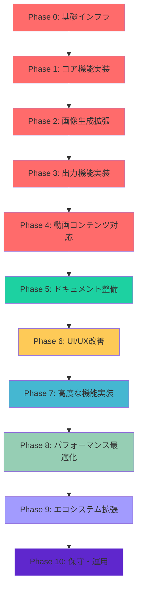
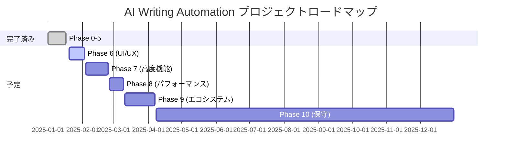

# プロジェクト全体フェーズ体系

**AI Writing Automationプロジェクトの全体像と今後のアクションプラン**

---

## 📊 プロジェクト現状

### ✅ 完了済み（Phase 0 - 5）

| Phase | 名称 | 状況 | 成果物 |
|-------|------|------|--------|
| **Phase 0** | 環境構築 | ✅ 完了 | リポジトリ、開発環境、認証設定 |
| **Phase 1** | コア機能（ブログ生成） | ✅ 完了 | ブログ生成パイプライン |
| **Phase 2** | 画像生成 | ✅ 完了 | DALL-E/Gemini連携 |
| **Phase 3** | Google Docs出力 | ✅ 完了 | テンプレート、自動ドキュメント生成 |
| **Phase 4** | YouTube/ゆっくり対応 | ✅ 完了 | 台本生成パイプライン |
| **Phase 5** | 拡張・最適化 | 🟡 進行中 | ドキュメント拡充 |

### 📝 ドキュメント完了状況（フェーズ1）

| ドキュメント | 状況 | 行数 |
|-------------|------|------|
| README.md | ✅ 完了（大幅更新） | 150行 |
| QUICKSTART.md | ✅ 新規作成 | 200行 |
| CHANGELOG.md | ✅ 新規作成 | 250行 |
| PROJECT_SUMMARY.md | ✅ 新規作成 | 350行 |
| MONETIZATION_TUTORIAL.md | ✅ 新規作成 | 400行 |
| COMPLETE_GUIDE.md | ✅ 完了（大幅拡充） | 2,675行 |
| BEGINNERS_GUIDE.md | ✅ 完了 | 721行 |
| MANUAL.md | ✅ 完了 | 111行 |

---

## 🎯 全体フェーズ体系

---

## 📋 各フェーズの詳細

### Phase 0: 基礎インフラ ✅ 完了

**期間**: 1日
**目的**: プロジェクトの基礎を構築

| タスク | 成果物 |
|-------|--------|
| GitHubリポジトリ作成 | ✅ リポジトリ作成完了 |
| Python環境セットアップ | ✅ pyproject.toml設定完了 |
| 外部サービス認証設定 | ✅ .env.example作成完了 |
| 開発環境構築 | ✅ pytest, pre-commit, CI/CD設定完了 |

---

### Phase 1: コア機能実装 ✅ 完了

**期間**: 3-4日
**目的**: ブログ記事生成のMVPを完成

| サブフェーズ | タスク | 成果物 |
|-------------|-------|--------|
| 基盤実装 | core/config.py, context.py, exceptions.py | ✅ 完成 |
| LLMサービス実装 | services/llm/base.py, openai.py | ✅ 完成 |
| パイプライン基盤 | pipeline/base.py, stages/base.py | ✅ 完成 |
| ブログ生成ステージ | search_intent.py, structure.py, title.py, lead.py, body.py, summary.py | ✅ 完成 |
| プロンプト作成 | prompts/blog/*.yaml (6つ) | ✅ 完成 |
| CLI実装 | cli.py | ✅ 完成 |

---

### Phase 2: 画像生成拡張 ✅ 完了

**期間**: 2-3日
**目的**: 記事に適した画像を自動生成

| サブフェーズ | タスク | 成果物 |
|-------------|-------|--------|
| 画像生成基盤 | services/image/base.py | ✅ 完成 |
| DALL-E実装 | services/image/dalle.py | ✅ 完成 |
| Gemini実装 | services/image/gemini.py | ✅ 完成 |
| 画像挿入ルール | stages/image_generation.py | ✅ 完成 |

---

### Phase 3: 出力機能実装 ✅ 完了

**期間**: 2日
**目的**: Google Docsへの自動出力

| サブフェーズ | タスク | 成果物 |
|-------------|-------|--------|
| Google Docsサービス | services/google/docs.py | ✅ 完成 |
| テンプレートエンジン | templates/engine.py, renderer.py | ✅ 完成 |
| テンプレート作成 | templates/*.json | ✅ 完成 |
| 統合 | Google Docs出力ステージ | ✅ 完成 |

---

### Phase 4: 動画コンテンツ対応 ✅ 完了

**期間**: 2日
**目的**: YouTube台本・ゆっくり動画台本の生成

| サブフェーズ | タスク | 成果物 |
|-------------|-------|--------|
| YouTube台本 | pipeline/youtube.py, stages/intro_ending.py, youtube_body.py | ✅ 完成 |
| ゆっくり台本 | pipeline/yukkuri.py, stages/yukkuri_script.py | ✅ 完成 |
| プロンプト作成 | prompts/youtube/*.yaml (4つ), yukkuri/*.yaml (3つ) | ✅ 完成 |
| 統合 | CLIにcontent-typeオプション追加 | ✅ 完成 |

---

### Phase 5: ドキュメント整備 ✅ 完了（フェーズ1）

**期間**: 継続
**目的**: ユーザー向けドキュメントを充実

| タスク | 成果物 | 行数 |
|-------|--------|------|
| README.md更新 | バッジ追加、開発状況反映、構造化 | 150行 |
| QUICKSTART.md作成 | 5分で使えるガイド | 200行 |
| CHANGELOG.md作成 | バージョン履歴 | 250行 |
| PROJECT_SUMMARY.md作成 | プロジェクト全体像 | 350行 |
| MONETIZATION_TUTORIAL.md作成 | 月5万円稼ぐチュートリアル | 400行 |
| COMPLETE_GUIDE.md拡充 | 第10章「運用フロー」追加 | 2,675行 |

---

## 🚀 次のアクション（フェーズ2-10）

### Phase 6: UI/UX改善 🟡 未着手

**期間**: 1-2週間
**目的**: ユーザー体験を向上

| タスク | 優先度 | 説明 |
|-------|--------|------|
| **進行状況表示の改善** | 高 | 現在の進行状況を視覚的に表示 |
| **エラーメッセージの改善** | 高 | わかりやすいエラーメッセージに |
| **コマンド補完の追加** | 中 | Tab補完機能を追加 |
| **カラフルな出力** | 中 | Richライブラリを活用 |

---

### Phase 7: 高度な機能実装 🟡 未着手

**期間**: 2-3週間
**目的**: 高度な機能を追加

| タスク | 優先度 | 説明 |
|-------|--------|------|
| **履歴管理機能** | 高 | 生成履歴のDB保存・再利用 |
| **バージョン管理** | 高 | 記事のバージョン管理 |
| **A/Bテスト** | 中 | 複数プロンプトの比較機能 |
| **並列生成** | 中 | 複数h2の同時生成 |
| **キーワード提案機能** | 中 | 次のキーワードを提案 |

---

### Phase 8: パフォーマンス最適化 🟡 未着手

**期間**: 1-2週間
**目的**: 処理速度を向上

| タスク | 優先度 | 説明 |
|-------|--------|------|
| **キャッシュ機構強化** | 高 | APIレスポンスのキャッシュ |
| **並列処理** | 高 | 複数API呼び出しの並列化 |
| **バッチ処理** | 中 | 複数記事の一括生成 |
| **メモリ最適化** | 中 | 大量データの効率的な処理 |

---

### Phase 9: エコシステム拡張 🟡 未着手

**期間**: 2-4週間
**目的**: 外部サービスとの連携を拡張

| タスク | 優先度 | 説明 |
|-------|--------|------|
| **Midjourney連携** | 高 | Midjourney API連携 |
| **Canva連携** | 高 | Canva API連携 |
| **WordPress直接投稿** | 中 | WordPress REST API連携 |
| **Notion出力** | 中 | Notion API連携 |
| **Slack通知** | 低 | 生成完了のSlack通知 |

---

### Phase 10: 保守・運用 🟡 未着手

**期間**: 継続
**目的**: 長期的な保守・運用

| タスク | 優先度 | 説明 |
|-------|--------|------|
| **テストカバレッジ向上** | 高 | テストカバレッジ80%以上 |
| **CI/CDの強化** | 高 | 自動デプロイ |
| **ドキュメントの更新** | 中 | ドキュメントの継続的更新 |
| **バグ修正** | 高 | バグの修正 |
| **ユーザーフィードバック対応** | 中 | ユーザーからのフィードバック対応 |

---

## 🎯 今後のロードマップ（まとめ）

---

## 📊 フェーズ別の成果物一覧

| Phase | 成果物 | ステータス |
|-------|--------|-----------|
| **Phase 0** | GitHubリポジトリ、開発環境、認証設定 | ✅ 完成 |
| **Phase 1** | ブログ生成パイプライン | ✅ 完成 |
| **Phase 2** | DALL-E/Gemini連携、画像生成 | ✅ 完成 |
| **Phase 3** | Google Docs出力機能 | ✅ 完成 |
| **Phase 4** | YouTube/ゆっくり台本生成 | ✅ 完成 |
| **Phase 5** | 完全ドキュメントセット | ✅ 完成 |
| **Phase 6** | 進行状況表示、エラーメッセージ改善 | 🟡 未着手 |
| **Phase 7** | 履歴管理、バージョン管理、A/Bテスト | 🟡 未着手 |
| **Phase 8** | キャッシュ強化、並列処理 | 🟡 未着手 |
| **Phase 9** | Midjourney/Canva/WordPress連携 | 🟡 未着手 |
| **Phase 10** | テスト、CI/CD、保守 | 🟡 未着手 |

---

## 🎓 次のステップ

フェーズ1の5つのタスクがすべて完了しました。次は以下のどれから進めるか選択できます：

### 優先度順の推奨アクション

1. **Phase 6: UI/UX改善** - ユーザー体験を向上
   - 進行状況表示の改善
   - エラーメッセージの改善

2. **Phase 7: 高度な機能実装** - 高度な機能を追加
   - 履歴管理機能
   - バージョン管理

3. **Phase 9: エコシステム拡張** - 外部サービスとの連携を拡張
   - Midjourney連携
   - Canva連携

どのフェーズから進めますか？

---

## 📚 ドキュメント体系（完了）

| ドキュメント | 目的 | 対象者 | 行数 |
|-------------|------|--------|------|
| README.md | プロジェクト概要 | すべてのユーザー | 150行 |
| QUICKSTART.md | 5分で始める | 急ぎのユーザー | 200行 |
| PROJECT_SUMMARY.md | プロジェクト全体像 | すべてのユーザー | 350行 |
| CHANGELOG.md | バージョン履歴 | すべてのユーザー | 250行 |
| MONETIZATION_TUTORIAL.md | 収益化実践 | 実践ユーザー | 400行 |
| COMPLETE_GUIDE.md | 包括的なガイド | 中級者〜上級者 | 2,675行 |
| BEGINNERS_GUIDE.md | 初心者向けガイド | 初心者 | 721行 |
| MANUAL.md | 利用マニュアル | 実践ユーザー | 111行 |
| REQUIREMENTS.md | 要件定義書 | 開発者 | 291行 |
| ARCHITECTURE.md | アーキテクチャ設計書 | 開発者 | 516行 |
| ROADMAP.md | 開発ロードマップ | プロジェクト管理 | 267行 |

---

## 🎯 現在のプロジェクト状態

### ✅ できていること
- コア機能の実装（ブログ、YouTube、ゆっくり）
- 画像生成機能（DALL-E, Gemini）
- Google Docs出力機能
- 完全なドキュメントセット（5,000行以上）

### 🟡 次にやるべきこと
- UI/UXの改善（進行状況表示、エラーメッセージ）
- 高度な機能の実装（履歴管理、バージョン管理）
- 外部サービスとの連携拡張（Midjourney, Canva）
- パフォーマンス最適化（キャッシュ、並列処理）

### 🔮 長期的なビジョン
- Web UIの実装（Streamlit or FastAPI + React）
- WordPress直接投稿
- マルチユーザー対応
- クラウドデプロイ（AWS, GCP, Azure）

---

**Next Steps:**
1. Phase 6, 7, 8, 9のどれから始めるか選択
2. 具体的な実装計画の作成
3. 開発の開始

---

**Ready for the next phase? Let's go! 🚀**
