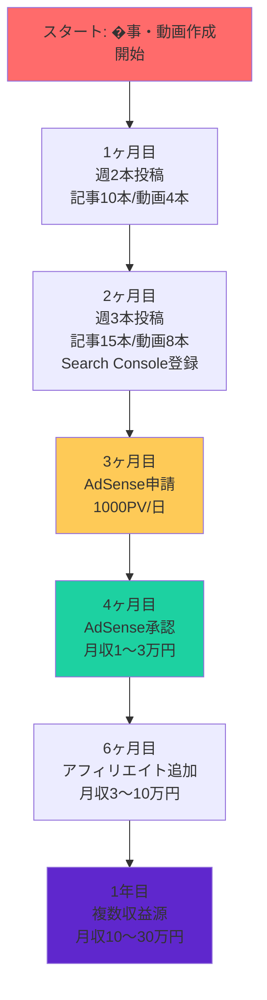

# AI Writing Automation - プロジェクトサマリー

**AIライティングノウハウの自動化システム - キーワードからGoogle Docs完成稿までをワンストップで生成するシステム**

---

## 📊 プロジェクト概要

| 項目 | 内容 |
|------|------|
| **目的** | 本山貴裕氏のAIライティングノウハウを自動化 |
| **ターゲット** | 副業初心者・AI初心者 |
| **コア技術** | Python 3.11+, OpenAI API, Google Docs API |
| **開発状況** | ✅ Phase 0-6 完了, ✅ Phase 7-9 完了 |
| **バージョン** | 0.3.0 (2025-01-18) |

---

## 🎯 3つの価値提案

### 1. 圧倒的な時間短縮
- **従来**: 1記事あたり数時間（SEO調査、構成、執筆）
- **ツール利用**: 5分（AI生成）+ 15〜30分（人間による編集）
- **効率**: **80〜90%の時間短縮**

### 2. SEO対策済みの品質
- 検索意図調査を自動化
- E-E-A-T（経験・専門性・権威性・信頼性）を意識した構成
- 2024-2025年のGoogle検索アルゴリズムに対応

### 3. マルチプラットフォーム対応
- ブログ記事
- YouTube台本（一人語り形式）
- ゆっくり動画台本（霊夢・魔理沙形式）
- Google Docs自動出力

---

## 🚀 主な機能

### ブログ記事生成
```
キーワード入力
  ↓
検索意図調査 → 構成作成 → タイトル → リード文 → 本文 → まとめ
  ↓
Google Docs完成稿
```

**所要時間**: 5分（AI生成）+ 15〜30分（人間による編集）

### YouTube台本生成
- **一人語り形式**: 視聴者を引きつけるフック・冒頭・本文・まとめ・エンディング
- **ゆっくり動画形式**: 霊夢と魔理沙の掛け合いでわかりやすく解説

**所要時間**: 5分（AI生成）+ 30分〜2時間（撮影準備・編集）

### 画像生成・配置
- **DALL-E** (OpenAI)
- **Gemini** (Google)
- **Midjourney** (Discord Bot API) ✅ 新規実装
- **Canva** (Designs API) ✅ 新規実装

### Google Docs自動出力
- テンプレートベースのドキュメント生成
- 画像の自動配置
- 差し込み変数によるカスタマイズ

---

## 📁 プロジェクト構造

```
ai-writing-automation/
├── src/ai_writing/          # メインパッケージ (58本のPythonファイル)
│   ├── core/                # 設定・コンテキスト・例外・データベース
│   │   ├── config.py         # 設定管理
│   │   ├── context.py         # 生成コンテキスト
│   │   ├── exceptions.py     # カスタム例外
│   │   ├── database.py       # データベース管理 ✅ 新規
│   │   └── history_manager.py # 履歴管理 ✅ 新規
│   ├── pipeline/            # 生成パイプライン (blog, youtube, yukkuri)
│   ├── stages/              # 各ステージ (検索意図、構成、本文等)
│   ├── services/            # 外部API連携
│   │   ├── llm/             # LLMサービス
│   │   │   ├── base.py     # 基底クラス
│   │   │   ├── openai.py   # OpenAI実装
│   │   │   ├── cache.py    # キャッシュ ✅ 新規
│   │   │   └── retry.py    # リトライ ✅ 新規
│   │   └── image/           # 画像生成
│   │       ├── base.py      # 基底クラス
│   │       ├── cache.py     # 画像キャッシュ
│   │       ├── dalle.py      # DALL-E実装
│   │       ├── gemini.py     # Gemini実装
│   │       ├── midjourney.py # Midjourney ✅ 完全実装
│   │       ├── canva.py      # Canva ✅ 完全実装
│   │       └── fallback.py   # フォールバック ✅ 新規
│   ├── templates/           # Jinja2テンプレート
│   └── utils/              # ユーティリティ
│   │       ├── parallel.py   # 並列処理 ✅ 新規
│   │       ├── streaming.py  # ストリーミング ✅ 新規
│   │       └── memory.py     # メモリ最適化 ✅ 新規
│   ├── prompts/             # プロンプトテンプレート (YAML)
│   │   ├── blog/            # ブログ用 (6つ)
│   │   ├── youtube/         # YouTube用 (4つ)
│   │   └── yukkuri/         # ゆっくり用 (3つ)
├── config/                  # 設定ファイル
├── templates/               # Google Docsテンプレート
├── docs/                    # ドキュメント
│   ├── COMPLETE_GUIDE.md    # 完全ガイド (2,675行)
│   ├── BEGINNERS_GUIDE.md   # 初心者ガイド (721行)
│   ├── MANUAL.md            # 利用マニュアル (111行)
│   ├── PROJECT_PHASES.md    # プロジェクトフェーズ
│   └── MONETIZATION_TUTORIAL.md # 収益化チュートリアル ✅ 新規
├── tests/                   # テストコード (19本)
├── README.md                # プロジェクト概要
├── QUICKSTART.md            # クイックスタート ✅ 新規 (200行)
├── CHANGELOG.md             # バージョン履歴 ✅ 更新
└── pyproject.toml           # プロジェクト設定
```

---

## 📚 ドキュメント体系

| ドキュメント | 目的 | 行数 | 対象者 |
|-------------|------|------|--------|
| **README.md** | プロジェクト概要 | 150行 | すべてのユーザー |
| **QUICKSTART.md** | 5分で始めるガイド | 200行 | 急ぎのユーザー |
| **BEGINNERS_GUIDE.md** | 初心者向け完全ガイド | 721行 | 初心者 |
| **COMPLETE_GUIDE.md** | 包括的な運用ガイド | 2,675行 | 中級者〜上級者 |
| **MANUAL.md** | 利用マニュアル | 111行 | 実践ユーザー |
| **REQUIREMENTS.md** | 要件定義書 | 291行 | 開発者 |
| **ARCHITECTURE.md** | アーキテクチャ設計書 | 516行 | 開発者 |
| **ROADMAP.md** | 開発ロードマップ | 267行 | プロジェクト管理 |
| **CHANGELOG.md** | バージョン履歴 | 更新済み | すべてのユーザー |
| **PROJECT_PHASES.md** | プロジェクトフェーズ一覧 | 新規 | プロジェクト管理 |
| **PROJECT_SUMMARY.md** | プロジェクトサマリー | 更新済み | すべてのユーザー |
| **MONETIZATION_TUTORIAL.md** | 収益化チュートリアル | 新規 | ユーザー |

---

## 🔧 技術スタック

| 領域 | 技術 | 理由 |
|------|------|------|
| **言語** | Python 3.11+ | 豊富なAI/APIライブラリ |
| **LLM API** | OpenAI API (GPT-4) | スプレッドシートの想定モデル |
| **画像生成** | DALL-E, Gemini, Midjourney, Canva | 高品質な画像生成 |
| **Google連携** | Google Docs API | 最終出力先 |
| **設定管理** | YAML | 人間が編集しやすい |
| **CLI** | Typer + Rich | モダンなCLIフレームワーク |
| **データベース** | SQLite3 | 永続的な履歴管理 |
| **キャッシュ** | diskcache, LRUキャッシュ | パフォーマンス最適化 |
| **非同期** | asyncio | 並列処理・ストリーミング |
| **認証** | Google OAuth2 | セキュアな認証フロー |

---

## 📈 開発フェーズ状況

| Phase | 名称 | 期間 | 状況 | 成果物 |
|-------|------|------|--------|--------|
| **Phase 0** | 環境構築 | 1日 | ✅ 完了 | リポジトリ、開発環境、認証設定 |
| **Phase 1** | コア機能（ブログ生成） | 3-4日 | ✅ 完了 | ブログ生成パイプライン（テキストのみ） |
| **Phase 2** | 画像生成 | 2-3日 | ✅ 完了 | DALL-E/Gemini連携、画像挿入 |
| **Phase 3** | Google Docs出力 | 2日 | ✅ 完了 | テンプレート、自動ドキュメント生成 |
| **Phase 4** | YouTube/ゆっくり対応 | 2日 | ✅ 完了 | 台本生成パイプライン |
| **Phase 5** | 拡張・最適化 | 継続 | 🟡 進行中 | Midjourney/Canva、UI、履歴管理 |
| **Phase 6** | UI/UX改善 | - | ✅ 完了 | Rich対応、プログレスバー、エラーメッセージ強化 |
| **Phase 7** | 履歴管理機能 | - | ✅ 完了 | SQLiteデータベース、履歴保存・検索・バージョン管理 |
| **Phase 8** | パフォーマンス最適化 | - | ✅ 完了 | LLMキャッシュ、並列処理、ストリーミング、メモリ最適化、レートリミット |
| **Phase 9** | エコシステム拡張 | - | ✅ 完了 | Midjourney・Canva完全実装、フォールバック戦略 |

---

## 🎯 ユースケース

### 副業でブログ収益化を目指す人
- **週間スケジュール**: 月〜金曜で記事・動画作成、土日で分析・計画
- **目標**: 3ヶ月で月5万円、1年で月10〜30万円
- **ツール活用**: 週3本の記事生成、週1本のYouTube動画

### YouTubeチャンネルを運営する人
- **動画種類**: 解説動画、レビュー動画、比較動画
- **フォーマット**: 一人語り形式、ゆっくり動画形式
- **ツール活用**: テーマから台本生成、撮影準備時間短縮

### 複数のクライアントに対応する人
- **クライアント別設定**: トーン、ターゲット年齢、キーワード密度
- **効率化**: 複数の記事を一括生成
- **管理**: クライアントごとの出力先設定

---

## 💰 収益化ロードマップ



**各段階のマイルストーン:**

| 段階 | �事数 | 動画数 | 月間PV | 月間再生 | 月収入 |
|--------|--------|--------|--------|--------|----------|
| **1ヶ月目** | 10本 | 4本 | 500 | 1,000 | 0円 |
| **2ヶ月目** | 15本 | 8本 | 2,000 | 3,000 | 0円 |
| **3ヶ月目** | 20本 | 12本 | 5,000 | 10,000 | 0円（AdSense申請） |
| **4ヶ月目** | 25本 | 16本 | 10,000 | 20,000 | 1〜3万円 |
| **6ヶ月目** | 35本 | 24本 | 30,000 | 50,000 | 3〜10万円 |
| **1年目** | 50本 | 48本 | 100,000 | 200,000 | 10〜30万円 |

詳細な収益化ロードマップは [docs/COMPLETE_GUIDE.md](docs/COMPLETE_GUIDE.md) を参照してください。

---

## 🔗 クイックリンク

- **GitHub Repository**: https://github.com/tndg16-bot/ai-writing-automation
- **Quick Start**: [QUICKSTART.md](QUICKSTART.md)
- **Complete Guide**: [docs/COMPLETE_GUIDE.md](docs/COMPLETE_GUIDE.md)
- **Beginners Guide**: [docs/BEGINNERS_GUIDE.md](docs/BEGINNERS_GUIDE.md)
- **User Manual**: [MANUAL.md](MANUAL.md)

---

## 🙏 クレジット

このプロジェクトは、本山貴裕氏のAIライティングノウハウをベースにしています。

---

**Happy Writing! ✨**
