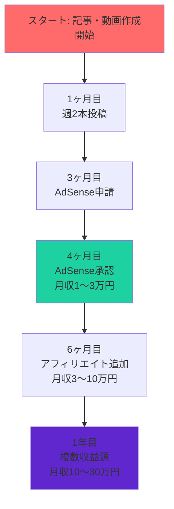

# AI Writing Automation

[](https://www.python.org/)
[](LICENSE)
[](CHANGELOG.md)

**AIライティングノウハウの自動化システム - キーワードからGoogle Docs完成稿まで**

本山貴裕氏のAIライティングノウハウ（スプレッドシート）を自動化し、キーワード入力からGoogle Docs完成稿までをワンストップで生成するシステムです。

---

## 🚀 クイックスタート

```bash
# クローンして環境構築
git clone https://github.com/tndg16-bot/ai-writing-automation.git
cd ai-writing-automation
python -m venv .venv
source .venv/bin/activate  # Windows: .venv\Scripts\activate
pip install -e ".[dev]"

# APIキー設定
cp .env.example .env
# .env を編集してOPENAI_API_KEYを設定

# 実行
python -m ai_writing generate "AI副業" --content-type blog
```

詳細なセットアップ手順は [QUICKSTART.md](QUICKSTART.md) を参照してください。

---

## ✨ 主な機能

| 機能 | 説明 | 所要時間 |
|------|------|----------|
| **ブログ記事生成** | SEO対策済みの完成度の高い記事を生成 | 約5分 |
| **YouTube台本生成** | 一人語り形式の動画台本を作成 | 約5分 |
| **ゆっくり動画台本** | 霊夢・魔理沙の掛け合い形式の台本 | 約5分 |
| **画像生成** | 記事に合った画像をAIで作成 | 約1分/枚 |
| **Google Docs出力** | 完成した記事をGoogle Docsに自動保存 | 即時 |

---

## 📊 3つの価値提案

### 🎯 圧倒的な時間短縮
- **従来**: 1記事あたり数時間（SEO調査、構成、執筆）
- **ツール利用**: 5分（AI生成）+ 15〜30分（人間による編集）
- **効率**: **80〜90%の時間短縮**

### 🔍 SEO対策済みの品質
- 検索意図調査を自動化
- E-E-A-T（経験・専門性・権威性・信頼性）を意識した構成
- 2024-2025年のGoogle検索アルゴリズムに対応

### 📺 マルチプラットフォーム対応
- ブログ記事
- YouTube台本（一人語り形式）
- ゆっくり動画台本（霊夢・魔理沙形式）
- Google Docs自動出力

---

## 🎓 ドキュメント

| ドキュメント | 内容 | 対象者 |
|-------------|------|--------|
| **[Quick Start](QUICKSTART.md)** | 5分で始めるガイド | 急ぎのユーザー |
| **[Project Summary](PROJECT_SUMMARY.md)** | プロジェクト全体の概要 | すべてのユーザー |
| **[Complete Guide](docs/COMPLETE_GUIDE.md)** | 包括的な運用ガイド（2,675行） | 中級者〜上級者 |
| **[Beginners Guide](docs/BEGINNERS_GUIDE.md)** | 初心者向け完全ガイド | 初心者 |
| **[User Manual](MANUAL.md)** | 利用マニュアル | 実践ユーザー |
| **[Requirements](REQUIREMENTS.md)** | 要件定義書 | 開発者 |
| **[Architecture](ARCHITECTURE.md)** | アーキテクチャ設計書 | 開発者 |
| **[Roadmap](ROADMAP.md)** | 開発ロードマップ | プロジェクト管理 |
| **[Changelog](CHANGELOG.md)** | バージョン履歴 | すべてのユーザー |

---

## 📚 学習パス

1. **Quick Start** - [QUICKSTART.md](QUICKSTART.md) で5分でツールを立ち上げる ✅
2. **Beginners Guide** - [docs/BEGINNERS_GUIDE.md](docs/BEGINNERS_GUIDE.md) で基礎知識を学ぶ
3. **Complete Guide** - [docs/COMPLETE_GUIDE.md](docs/COMPLETE_GUIDE.md) で運用フローを学ぶ
4. **実践** - 実際に記事を生成し、編集・公開してみる
5. **改善** - データを分析し、改善を繰り返す

---

## 💰 収益化ロードマップ



詳細な収益化ロードマップは [docs/COMPLETE_GUIDE.md](docs/COMPLETE_GUIDE.md#106-収益化までのロードマップ) を参照してください。

---

## 🔧 技術スタック

| 領域 | 技術 |
|------|------|
| **言語** | Python 3.11+ |
| **LLM API** | OpenAI API (GPT-4) |
| **画像生成** | DALL-E, Gemini, Midjourney, Canva |
| **Google連携** | Google Docs API, OAuth2 |
| **設定管理** | YAML |
| **CLI** | Typer |

---

## 📈 開発状況

| Phase | 名称 | 期間 | 状況 | 成果物 |
|-------|------|------|------|--------|
| **Phase 0** | 環境構築 | 1日 | ✅ 完了 | リポジトリ、開発環境、認証設定 |
| **Phase 1** | コア機能（ブログ生成） | 3-4日 | ✅ 完了 | ブログ生成パイプライン（テキストのみ） |
| **Phase 2** | 画像生成 | 2-3日 | ✅ 完了 | DALL-E/Gemini連携、画像挿入 |
| **Phase 3** | Google Docs出力 | 2日 | ✅ 完了 | テンプレート、自動ドキュメント生成 |
| **Phase 4** | YouTube/ゆっくり対応 | 2日 | ✅ 完了 | 台本生成パイプライン |
| **Phase 5** | 拡張・最適化 | 継続 | 🟡 進行中 | Midjourney/Canva、UI、履歴管理 |

---

## 🎯 プロジェクト構造

```
ai-writing-automation/
├── src/ai_writing/          # メインパッケージ (47本のPythonファイル)
│   ├── core/                # 設定・コンテキスト・例外
│   ├── pipeline/            # 生成パイプライン (blog, youtube, yukkuri)
│   ├── stages/              # 各ステージ (検索意図、構成、本文等)
│   ├── services/            # 外部API連携
│   ├── templates/           # Jinja2テンプレート
│   └── utils/               # ユーティリティ
├── prompts/                 # プロンプトテンプレート (YAML)
│   ├── blog/                # ブログ用 (6つ)
│   ├── youtube/             # YouTube用 (4つ)
│   └── yukkuri/             # ゆっくり用 (3つ)
├── config/                  # 設定ファイル
├── templates/               # Google Docsテンプレート
├── docs/                    # ドキュメント
├── tests/                   # テストコード (19本)
└── README.md                # このファイル
```

詳細な構造は [ARCHITECTURE.md](ARCHITECTURE.md) を参照してください。

---

## 🤝 コントリビューション

Issue や Pull Request をお待ちしています！

1. [Issues](https://github.com/tndg16-bot/ai-writing-automation/issues) でバグ報告や機能リクエストを作成
2. [Pull Requests](https://github.com/tndg16-bot/ai-writing-automation/pulls) でコントリビュート

---

## 📄 ライセンス

MIT License - 自由に使用・改変・配布できます。

---

## 🔗 クイックリンク

- **GitHub Repository**: https://github.com/tndg16-bot/ai-writing-automation
- **Issues**: https://github.com/tndg16-bot/ai-writing-automation/issues
- **Discussions**: https://github.com/tndg16-bot/ai-writing-automation/discussions

---

## 🙏 クレジット

このプロジェクトは、本山貴裕氏のAIライティングノウハウをベースにしています。

---

**Happy Writing! ✨**
