# AI ライティング自動化ツール 完全ガイド

**副業初心者・AI初心者のための包括的な教科書**
**2024-2025年の最新SEO・ライティング・AIトレンドを網羅**

---

## 目次

1. [はじめに - このツールで何ができる？](#1-はじめに---このツールで何ができる)
2. [前提知識その1: AIについて理解しよう](#2-前提知識その1-aiについて理解しよう)
3. [前提知識その2: Webライティングの基礎](#3-前提知識その2-webライティングの基礎)
4. [前提知識その3: SEOの基礎知識](#4-前提知識その3-seoの基礎知識)
5. [収益化の基礎 - どうやって稼ぐ？](#5-収益化の基礎---どうやって稼ぐ)
6. [環境構築: 必要なソフトのインストール](#6-環境構築-必要なソフトのインストール)
7. [APIキーの取得方法](#7-apiキーの取得方法)
8. [ツールのセットアップ](#8-ツールのセットアップ)
9. [実践編: ブログ記事を自動生成してみよう](#9-実践編-ブログ記事を自動生成してみよう)
10. [全体の運用フロー詳細](#10-全体の運用フロー詳細) (週間スケジュール、ブログ生成フロー、YouTube生成フロー、マルチプラットフォーム活用、収益化ロードマップ)
11. [実践編: YouTube台本を自動生成してみよう](#11-実践編-youtube台本を自動生成してみよう) (詳細: 一人語り・ゆっくり動画、ワークフロー、カスタマイズ、収益化、チャンネル運営)
12. [トラブルシューティング・よくある質問](#12-トラブルシューティングよくある質問)
13. [発展的な使い方・カスタマイズ](#13-発展的な使い方カスタマイズ)
14. [AI時代のライター生存戦略](#14-ai時代のライター生存戦略)
15. [用語集](#15-用語集)

---

## 1. はじめに - このツールで何ができる？

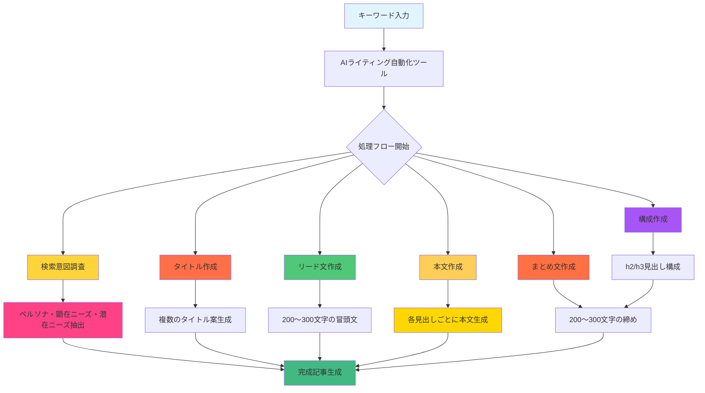

### 1.1 このツールの目的

「AI ライティング自動化ツール」は、**キーワードを入力するだけで、SEOに強いブログ記事やYouTube台本を自動生成**するシステムです。

従来、プロのWebライターが数時間かけて行っていた作業を、AIの力で数分〜十数分に短縮できます。

**2024-2025年の重要な変化**:
- GoogleがAI生成検索（AI Overview）を正式導入
- E-E-A-T（経験・専門性・権威性・信頼性）がさらに重要化
- AIコンテンツの品質差が明確に
- 人間とAIの協働が必須に

### 1.2 具体的にできること

| 機能 | 説明 | 所要時間 | 期待される成果 |
|------|------|----------|--------------|
| ブログ記事の自動生成 | SEO対策済みの完成度の高い記事を生成 | 約5分 | 5,000〜10,000文字の記事 |
| YouTube台本の生成 | 一人語り形式の動画台本を作成 | 約5分 | 2,000〜3,000字の台本 |
| ゆっくり動画台本 | 霊夢・魔理沙の掛け合い形式の台本 | 約5分 | 掛け合い構成の台本 |
| 画像の自動生成 | 記事に合った画像をAIで作成 | 約1分/枚 | テーマに沿った画像 |
| Google Docsへの出力 | 完成した記事をGoogle Docsに自動保存 | 即時 | 編集準備完了状態 |

### 1.3 こんな人におすすめ

- **副業でWebライターを始めたい方** → 月5〜10万円の収益が可能
- **ブログ収益化を目指している方** → アドセンス・アフィリエイト対応
- **YouTube動画の台本作成を効率化したい方** → チャンネル運営の時間短縮
- **AIツールを活用して作業効率を上げたい方** → AI×人間の最適なワークフロー
- **プログラミング未経験でもOK** → 手順通りにやれば大丈夫
- **本業を持ちながらスキマ時間で稼ぎたい方** → 1日1時間からスタート可能

### 1.4 このツールを使う上での心構え

> **重要（2025年のSEO最重要ポイント）**: AIが生成した文章は「たたき台」です。
> 
> **E-E-A-T（経験・専門性・権威性・信頼性）**を高めるために、人間の編集が必須です。
> 
> Googleの2024-2025年のコアアップデートにより、**AIそのままの低品質コンテンツはペナルティの対象**になっています。

**必ず行うべきこと**:
- 事実確認（ファクトチェック）
- 自分の経験・視点を追加
- 最新情報の補完
- 読みやすさの調整
- ユニーク性の担保

---

## 2. 前提知識その1: AIについて理解しよう

### 2.1 AIとは？

**AI（人工知能）**とは、人間の知能を模倣するコンピュータプログラムのことです。

このツールで使用するのは「**生成AI**」と呼ばれる種類のAIで、特に文章を生成する能力に優れた「**大規模言語モデル（LLM）**」を使用しています。

### 2.2 ChatGPT・Claude・Geminiとは？

| モデル | 開発元 | 特徴 | 用途 |
|--------|---------|------|------|
| GPT-4o | OpenAI | 最強の文章生成能力、マルチモーダル | ブログ記事、台本 |
| Claude 3.5 Sonnet | Anthropic | 長文対応、自然な日本語 | 複雑な構成 |
| Gemini Pro | Google | 最新情報へのアクセス、画像生成 | リサーチ、画像 |

### 2.3 APIとは？

**API（Application Programming Interface）**とは、プログラム同士が会話するための「窓口」のようなものです。

例えるなら：
- ChatGPTのWebサイト → 人間が直接話しかける（手動）
- ChatGPT API → プログラムが自動で話しかける（自動化）

### 2.4 AIを使う上での注意点（2025年最新）

| 注意点 | 詳細 |
|--------|--------|
| **ハルシネーション** | AIは「もっともらしい嘘」をつくことがあります。特に数字や事実は必ず確認しましょう。 |
| **GoogleのAIコンテンツへのスタンス** | AI生成そのままで低品質なコンテンツは検索順位低下の原因に。人間の編集が必須。 |
| **著作権** | AI生成コンテンツの著作権は議論中です。独自の編集を加えることを強く推奨します。 |
| **コスト管理** | API利用には料金がかかります（GPT-4: $0.03/1K tokens）。予算管理が重要。 |
| **過度な依存** | AIはあくまで「ツール」。自分のスキルアップも忘れずに。 |
| **最新情報の制限** | LLMの学習データには期限があります。最新情報を確認するプロセスが必要。 |

### 2.5 プロンプトエンジニアリングとは？

**プロンプト**とは、AIに対する「指示文」のこと。
**プロンプトエンジニアリング**は、AIから最適な回答を引き出すための技術です。

```
悪い例: 「記事を書いて」

良い例: 
「『AI副業』というキーワードで、以下の条件を満たすSEOブログ記事を書いてください。
・ペルソナ: 30代会社員、副業に興味あり
・文章量: 2000文字程度
・構成: PREP法を意識
・見出し: h2は3つ、h3は各h2に2つ
・トーン: 丁寧だが親しみやすい」
```

**最新のプロンプト技法（2024-2025）**:

1. **Role-based Prompting**: AIに役割を与える
   ```
   「あなたはSEOの専門家です。10年以上の経験があります...」
   ```

2. **Chain of Thought**: 思考プロセスを明示
   ```
   「まずステップ1で考え、次にステップ2で、最後に...」
   ```

3. **Few-shot Learning**: 例を与える
   ```
   「良いタイトルの例:
   例1: 【2024年】AI副業の始め方完全ガイド
   例2: 3ヶ月で月5万円稼ぐ方法
   上記を参考に...」
   ```

4. **Output Formatting**: 出力形式を指定
   ```
   「以下のJSON形式で出力してください: {...}」
   ```

このツールは、これらの技法を取り入れた「最適なプロンプト」をあらかじめ設定しています。

---

## 3. 前提知識その2: Webライティングの基礎

### 3.1 Webライティングとは？

**Webライティング**とは、Webサイトやブログに掲載する文章を書くスキルです。
紙の文章とは異なり、以下の特徴があります：

| 項目 | 紙の文章 | Web文章 |
|------|---------|---------|
| 読み方 | じっくり読む | 流し読み・スキャン |
| 構成 | 起承転結 | 結論ファースト |
| 長さ | 長くてもOK | 短く区切る |
| 装飾 | 少ない | 見出し・箇条書き多用 |
| 目的 | 読み切ってもらう | 必要情報を瞬時に伝える |

### 3.2 PREP法とは？

このツールが採用している文章構成法「**PREP法**」を理解しましょう。

```
P - Point（結論）  : まず結論を述べる
R - Reason（理由） : なぜそう言えるのか
E - Example（例）  : 具体例を示す
P - Point（結論）  : 最後にもう一度結論
```

**例：**
```
【P】副業にはAIライティングがおすすめです。
【R】なぜなら、初期投資が少なく、スキマ時間で取り組めるからです。
【E】実際に、会社員のAさんは、通勤時間と夜の1時間で月5万円を達成しました。
【P】このように、AIライティングは副業の最適解と言えるでしょう。
```

**PREP法のバリエーション**:

1. **SDS法**（Summary, Detail, Summary）
   ```
   要約 → 詳細 → 要約
   特に説明文で有効
   ```

2. **PASONA法**（Problem, Agitation, Solution, Narrative, Action）
   ```
   問題 → 問題の強調 → 解決策 → 具体的な事例 → 行動喚起
   セールスコピーでよく使われる
   ```

3. **PASTA法**（Past, Alternative, Solution, Tie-down, Action）
   ```
   過去 → 他の選択肢 → 解決策 → ベネフィット → 行動
   プレゼンで有効
   ```

### 3.3 読みやすい文章のポイント

1. **一文は短く**（60文字以内が目安）
   ```
   ×: AIは最近進化しており、文章を書いたり、
     データを分析したりすることができますが...
   
   ○: AIは最近急速に進化しました。
     文章作成やデータ分析が可能になっています。
   ```

2. **結論を先に**書く

3. **見出しを活用**して構造化

4. **箇条書き**で情報を整理

5. **具体的な数字**を入れる
   ```
   ×: 多くの人が...
   ○: 7割以上の人が...
   ```

6. **難しい言葉を避ける**（専門用語は説明を添える）

7. **一文一義**を守る（一つの文章に一つの意味）

8. **逆三角形型**で考える（一番伝えたいことを最初に）

### 3.4 ペルソナとは？

**ペルソナ**とは、「想定読者」の具体的なプロフィールのことです。

```
例: 「AI副業」記事のペルソナ
----------------------------
名前: 田中太郎（仮名）
年齢: 35歳
職業: 中小企業の営業職
年収: 450万円
悩み: 給料が上がらない、副業で収入を増やしたい
状況: PC操作は基本的にできる、AIは聞いたことあるが使ったことない
目標: 月5万円の副収入を得たい
価値観: 時間を有効に使いたい、リスクは避けたい
```

**ペルソナの詳細化ポイント**:
- 年齢・性別
- 職業・年収
- 家族構成
- 趣味・ライフスタイル
- 抱える悩み
- 目標・価値観
- 知識レベル
- 行動特性

ペルソナを明確にすることで、「誰に向けて書くか」がブレなくなり、読者に刺さる文章が書けます。

---

## 4. 前提知識その3: SEOの基礎知識

### 4.1 SEOとは？

**SEO（Search Engine Optimization）**とは、「検索エンジン最適化」の略です。

Googleなどの検索エンジンで、自分の記事を**上位表示させるための技術**です。

```
ユーザーが検索 → Google が記事を評価 → 順位を決定 → 表示

上位表示されれば → 多くの人が読む → 収益につながる
```

### 4.2 なぜSEOが重要なのか？（2025年最新）

```mermaid
%%{init: {'theme':'base'}}
graph TD
    subgraph 検索順位
        A[1位]
        B[2位]
        C[3位]
        D[4位]
        E[5位]
        F[10位]
        
        A -->|CTR: 30%<br/>月間PV: 300PV
        B -->|CTR: 15%<br/>月間PV: 150PV
        C -->|CTR: 10%<br/>月間PV: 100PV
        D -->|CTR: 7%<br/>月間PV: 70PV
        E -->|CTR: 5%<br/>月間PV: 50PV
        F -->|CTR: 2%<br/>月間PV: 20PV
        
        style A fill:#90ed0e
        style B fill:#70ad47
        style C fill:#5cb85c
        style D fill:#4caf50
        style E fill:#47a7da
        style F fill:#2c8e2
    end
```

**つまり**: 上位表示されなければ、どんなに良い記事も読まれないのです。

### 4.3 SEOの基本要素（2025年最新）

#### 4.3.1 E-E-A-Tとは？

Googleの検索品質評価ガイドラインの中心となる概念です：

```
┌──────────────────────────────────────┐
│ E - Experience（経験） : 実際の経験があるか？     │
├──────────────────────────────────────────┤
│ E - Expertise（専門性） : その分野の専門家か？     │
├──────────────────────────────────────────┤
│ A - Authoritativeness（権威性）: 信頼されているか？     │
├──────────────────────────────────────────┤
│ T - Trustworthiness（信頼性）: 信頼できる情報か？ │
└──────────────────────────────────────────────┘
```

**2025年にさらに重要化された理由**:
- AIコンテンツの洪水により「人の経験」が希少価値に
- Googleは「本物の経験」を持つコンテンツを優遇
- 寄生サイト・低品質AIコンテンツの排除が強化

**E-E-A-Tを高める方法**:
- 実際の経験談を書く
- 具体的な例やデータを示す
- 信頼できる情報源を引用
- プロフィールを充実させる
- 最新情報を提供する

#### 4.3.2 キーワード選定

記事のテーマとなる「検索キーワード」を決めます。

```
良いキーワードの例:
✅ 「AI 副業 初心者 2024」 ← 具体的、検索されやすい、最新情報
✅ 「ChatGPT 使い方 無料 仕事」 ← ニーズが明確
✅ 「副業 月5万円 会社員」 ← 具体的な数字、ターゲット明確

悪いキーワードの例:
❌ 「AI」 ← 範囲が広すぎる、競合が強すぎる
❌ 「副業で稼ぐ方法を教えて」 ← 検索されない形式（会話形式）
❌ 「稼ぐ」 ← 抽象的すぎる
```

**ロングテールキーワード**の重要性:
```
ショートテール: 「AI」（検索ボリューム: 100万〜）
→ 競合が激し、上位表示困難

ロングテール: 「AI副業 初心者 2024」（検索ボリューム: 100〜1,000）
→ 競合が少なく、上位表示しやすい
→ コンバージョン率が高い（具体的なニーズ）
```

**キーワード選定ツール**:
- Google Keyword Planner
- ラッコキーワード（日本）
- Keyword Surfer
- Ahrefs（有料）

#### 4.3.3 タイトルの付け方（2025年最新）

```
良いタイトルの例:
✅ 「【2024年最新】AI副業の始め方完全ガイド｜初心者でも月5万円」
   - 【2024年最新】: 最新感
   - 完全ガイド: 包括性
   - AI副業の始め方: キーワード含む
   - 初心者でも: 対象者明確
   - 月5万円: 具体的なベネフィット、数字が入る
   - 32文字前後: スマートフォンで見切れる

良いタイトルの例（CTR重視）:
✅ 「1日30分で月5万円！会社員でもできるAI副業の完全マニュアル」
   - 具体的な時間: 1日30分
   - 具体的な収益: 月5万円
   - ターゲット: 会社員
   - 完全マニュアル: 包括性

悪いタイトルの例:
❌ 「副業について」 ← 漠然としすぎ、キーワード薄い
❌ 「AIを使った副業の方法を詳しく解説します」 ← 長すぎ、キーワード薄い、ベネフィット不明
❌ 「ブログの書き方」 ← 競合多すぎ、独自性なし
```

**クリック率を上げるテクニック**:
1. 数字を入れる（「3つ」「5分」「2024年」）
2. 強調語を使う（「完全」「必見」「最新」）
3. ベネフィットを明確に（「月5万円」「時間短縮」）
4. キーワードを含める
5. 長さは32文字前後（モバイル対応）

#### 4.3.4 見出し構成（h2/h3）

```
記事の構造例:
────────────────────────
h1: 【タイトル】AI副業の始め方完全ガイド
  │
  ├─ h2: AI副業とは？
  │    ├─ h3: AI副業の定義と特徴
  │    ├─ h3: AI副業の種類
  │    └─ h3: 2024年〜2025年の最新トレンド
  │
  ├─ h2: AI副業のメリット・デメリット
  │    ├─ h3: 3つのメリット
  │    └─ h3: 注意すべきデメリット
  │
  ├─ h2: AI副業の始め方5ステップ
  │    ├─ h3: ステップ1: ツールを選ぶ
  │    ├─ h3: ステップ2: 練習する
  │    ├─ h3: ステップ3: 実際にやってみる
  │    ├─ h3: ステップ4: 収益化する
  │    └─ h3: ステップ5: 拡大する
  │
  ├─ h2: 月5万円の収益化事例
  │    ├─ h3: 成功事例1: 会社員Aさん
  │    └─ h3: 成功事例2: 主婦Bさん
  │
  └─ h2: まとめ
────────────────────────
```

**見出しのポイント**:
- h2は3〜5個
- 各h2にh3を1〜3個
- 見出しにもキーワードを入れる
- 読者の疑問に答える構成にする

### 4.4 E-E-A-Tを視覚的に理解するための図

```mermaid
graph TD
    subgraph E[Experience 経験]
        E1[実際にそのサービスを利用した経験]
        E2[その分野での実績]
        E3[リアルな事例やエピソード]
        E4[データや統計を交える]
    
    subgraph Ex[Expertise 専門性]
        Ex1[その分野での専門知識]
        Ex2[資格・免許の証明書]
        Ex3[学術論文や研究]
        Ex4[他の専門家からの引用]
    
    subgraph A[Authoritativeness 権威性]
        A1[社会的な認知度]
        A2[業界での影響力]
        A3[メディア掲載歴]
        A4[著名な機関への寄稿]
    
    subgraph T[Trustworthiness 信頼性]
        T1[情報の正確性]
        T2[引用元の信頼性]
        T3[定期的な更新]
        T4[透明性・責任]
        T5[プライバシーポリシー]
    
    subgraph EEAT[<b>AIコンテンツ</b>]
        AI -.-> E
        AI -.-> Ex
        AI -.-> A
        AI -.-> T
    
    style EEAT fill:#fff1f0
    style E fill:#e8f1f0
    style Ex fill:#ffd4b0
    style A fill:#4caf50
    style T fill:#98fb98
    style AI fill:#1f77b4
    
    E -.->|E1|
    Ex -.->|E2|
    Ex -.->|E3|
    E -.->|E4|
    A -.->|A1|
    A -.->|A2|
    A -.->|A3|
    A -.->|A4|
    T -.->|T1|
    T -.->|T2|
    T -.->|T3|
    T -.->|T4|
    T -.->|T5|
    
    subgraph G[Googleの評価]
        G1[ユーザー体験]
        G2[情報の鮮明性]
        G3[コンテンツの品質]
        G4[独自性と差別化]
        G5[ユーザビリティ]
```

**E-E-A-Tの相互作用**:
- Experience（経験）は、Expertise（専門性）を補強する
- Expertise（専門性）は、Authoritativeness（権威性）を裏付ける
- 全てがTrustworthiness（信頼性）の基礎となる

**AIコンテンツの評価**:
- AI生成そのまま → 低評価（ペナルティのリスク）
- AI + 人間の編集 → 中評価
- AI + 人間の編集 + 独自性 → 高評価

### 4.4.1 検索意図とE-E-A-Tの関係

```mermaid
graph LR
    subgraph 検索キーワード["AI副業"]
        K1[顕在ニーズ<br/>「AI副業のやり方」]
        K2[潜在ニーズ<br/>「収入を増やして<br/>生活を楽にしたい」]
    
    K1 --> D1[SEO記事]
    K2 --> D2[比較記事]
    K2 --> D3[商品紹介記事]
    D1 -->|V1[SEO評価↑]
    D2 -->|V2[信頼性↓]
    D3 -->|V3[権威性?]
    
    style K1 fill:#ffe4e1
    style K2 fill:#ff8a5e
    style D1 fill:#f1f5e9
    style D2 fill:#f2f5e9
    style D3 fill:#f3f5e9
    style V1 fill:#00b894
    style V2 fill:#00b894
    style V3 fill:#00b894
```

**ニーズに対応するコンテンツタイプ**:
- 顕在ニーズ → 手順・ガイド（How-to）
- 潜在ニーズ → 効果・メリット・デメリット（比較記事）
- 混合ニーズ → 総合的な解決策（Q&A形式）

### 4.4.2 SEO順位とCTRの関係

```mermaid
graph LR
    X[1位]
    X -->|C1[CTR: 30%<br/>PV: 300/月]
    
    X2[2位]
    X2 -->|C2[CTR: 15%<br/>PV: 150/月]
    
    X3[3位]
    X3 -->|C3[CTR: 10%<br/>PV: 100/月]
    
    X4[4位]
    X4 -->|C4[CTR: 7%<br/>PV: 70/月]
    
    X5[5位]
    X5 -->|C5[CTR: 5%<br/>PV: 50/月]
    
    X6[10位]
    X6 -->|C6[CTR: 2%<br/>PV: 20/月]
    
    X7[2ページ目以降]
    X7 -->|C7[CTR: ほぼ0%<br/>PV: 数PV以下]
    
    style X1 fill:#00b894
    style X2 fill:#00b894
    style X3 fill:#00b894
    style X4 fill:#00b894
    style X5 fill:#00b894
    style X6 fill:#00b894
    style X7 fill:#00b894
    style C1 fill:#00b894
    style C2 fill:#00b894
    style C3 fill:#00b894
    style C4 fill:#00b894
    style C5 fill:#00b894
    style C6 fill:#00b894
    style C7 fill:#999999
```

**収益の計算式**:
```
収益 = PV × CTR(%) × RPM(円/100PV)

例1位の場合:
PV = 300/月
CTR = 30%
RPM = 100円/100PV（金融・IT系の想定）
収益 = 300 × 0.30 × 100 = 9,000円/月

例10位の場合:
PV = 50/月
CTR = 5%
RPM = 100円/100PV
収益 = 50 × 0.05 × 100 = 250円/月
```

### 4.4.2 AI時代のGoogle評価フロー

```mermaid
graph TD
    Start[ユーザーが検索]
    Start -->|Query[クエリ入力]
    
    Query -->|S{AI Overview<br/>Google AI要約}
    S -->|Results[AIの要約を表示]
    
    Results -->|Click{ユーザーがクリックするか？}
    
    Click -->|Y1[は: 通常の検索結果へ移動]
    Click -->|N1[いい: AI要約をクリック<br/>サイトに直接飛ぶ]
    
    Y1 -->|B1[サイト訪問]
    B1 -->|E1[コンテンツを確認]
    E1 -->|J1[E-E-A-T評価]
    
    N1 -->|B2[AI要約を確認]
    B2 -->|E2[E-E-A-T評価]
    
    J1 -.->|R1[評価結果]
    E2 -.->|R2[評価結果]
    
    R1 -->|F1[評価↑]
    R2 -->|F2[評価↓]
    F1 -.->|High[高評価]
    F2 -.->|Low[低評価]
    
    High -.-> U1[順位アップ]
    Low -.-> D1[順位ダウン]
    
    U1 -.-> K1[検索表示が増える]
    D1 -.-> K2[クリック率が下がる]
    
    style S fill:#a855f7
    style Results fill:#ffd43b
    style E1 fill:#e8f1f0
    style E2 fill:#ffd4b0
    style R1 fill:#00b894
    style R2 fill:#00b894
    style F1 fill:#00b894
    style F2 fill:#00b894
    style High fill:#00b894
    style Low fill:#00b894
    style U1 fill:#00b894
    style K1 fill:#00b894
    style K2 fill:#00b894
    style D1 fill:#00b894
```

**AI Overviewで引用されるための戦略**:
1. **情報の正確性を担保**: 最新データ、統計を活用
2. **構造化された情報を提供**: 箇条書き・分かりやすい構成
3. **信頼できる情報源を示す**: 官際の引用、専門家の意見
4. **ユーザーの質問に直接答える**: 具体的な解決策を提示
5. **行動を促す**: 実際に使えるCTAを明確にする

| 検索キーワード | 顕在ニーズ（表面的） | 潜在ニーズ（深層） |
|---------------|---------------------|-------------------|
| 「AI 副業」 | AI副業のやり方を知りたい | 収入を増やして生活を楽にしたい、自己実現したい |
| 「ダイエット 方法」 | 痩せる方法を知りたい | 自分に自信を持ちたい、モテたい、健康になりたい |
| 「転職 30代」 | 転職の方法を知りたい | 今の会社への不満を解消したい、年収を上げたい |
| 「WordPress 作り方」 | ブログの始め方を知りたい | 収益化して自由になりたい、スキルを身につけたい |

**検索意図の分類**:

1. **Informational（情報検索）**: 「〜とは」「〜方法」
   → 詳細な情報を提供

2. **Navigational（ナビゲーション）**: 「Amazon」「YouTube」
   → 特定サイトへの誘導

3. **Commercial（商用）**: 「おすすめ」「比較」
   → 商品・サービスの紹介

4. **Transactional（取引）**: 「価格」「購入」
   → 購入の促進

このツールは、キーワードから**検索意図を自動で分析**し、読者のニーズに応える記事を生成します。

### 4.5 AI時代のSEO対策（2025年重要）

**Googleの変化**:
- **AI Overviewの導入**: 検索結果の1位にAIの要約が表示
- **Helpful Content Updateの継続**: 有益なコンテンツを優遇
- **SpamBrainの強化**: 低品質・スパムサイトを排除

**AIコンテンツの扱い**:
```
×: AI生成をそのまま公開
  → 低品質判定、ペナルティの可能性

○: AI生成 + 人間の編集（経験・独自性を追加）
  → E-E-A-Tが高まり、評価アップ
```

**AI Overviewで引用されるための対策**:
1. 情報の正確性を担保
2. 具体的な数値・例を含める
3. 構造化された情報を提供
4. 信頼できる情報源を引用
5. ユーザーの質問に直接答える

---

## 5. 収益化の基礎 - どうやって稼ぐ？

### 5.1 ブログ収益化の主な方法

| 方法 | 仕組み | 収益性（初心者） | 難易度 |
|------|--------|------------------|--------|
| **Google AdSense** | 広告表示で報酬 | 月1〜3万円 | ★★★☆☆ |
| **アフィリエイト** | 商品紹介で報酬 | 月3〜10万円 | ★★★★☆ |
| **デジタルコンテンツ販売** | eBook・講座販売 | 月5〜20万円 | ★★★★☆ |
| **オンラインサロン** | 月額課金コミュニティ | 月5〜30万円 | ★★★★★ |
| **コラム執筆** | 媒体への寄稿 | 月2〜10万円 | ★★★★☆ |

### 5.2 Google AdSenseについて

**概要**: ブログに広告を表示し、クリック・表示で報酬を得る

**成功事例**（2024年実例）:
- 9か月で74記事を投稿
- 9回目の申請で審査通過
- 月1〜3万円の収益

**AdSense審査を通過するための条件**:

1. **記事数**: 最低10〜15記事（推奨: 20記事以上）
2. **コンテンツの質**:
   - オリジナルであること
   - 文法が正しいこと
   - 段落分け・見出しがあること
3. **サイト運営期間**: 1〜3ヶ月以上
4. **プライバシーポリシー**: 必須
5. **特定商取引法に基づく表記**: 必須

**AdSense収益を増やすポイント**:

```
収益 = PV × CTR（クリック率）× RPM（クリック単価）

各要素を改善する方法:
```

**PVを増やす方法**:
- 適切なジャンルを選ぶ（月間検索ボリューム: 100〜1,000が狙い目安）
- 記事を継続的に更新（週2〜3本）
- 検索意図に応える質の高い記事を書く
- 内部リンクを構築

**CTR（クリック率）を上げる方法**:
- 広告の配置を工夫（記事中・目次後など）
- 広告サイズを最適化
- モバイルフレンドリーに対応
- 誤クリックを避ける（ユーザビリティ向上）

**RPM（クリック単価）を上げる方法**:
- ジャンル選定を見直す（金融・IT系は単価が高い）
- ターゲットを明確にする（購買意欲の高い層）

### 5.3 アフィリエイトについて

**概要**: 他社の商品・サービスを紹介し、購入で報酬を得る

**主要なASP**:
- A8.net
- afb
- 楽天アフィリエイト
- Amazonアソシエイト

**成功のポイント**:
1. ジャンルと商品をマッチさせる
2. 信頼性を高める（実際に使ってから紹介）
3. ベネフィットを明確に伝える
4. 比較・口コミを交える
5. CTA（Call to Action）を明確にする

**アフィリエイト記事の構成例**:
```
h1: おすすめのアイテム5選
  ├─ h2: アイテム1の特徴とメリット
  ├─ h2: アイテム2の特徴とメリット
  ├─ ...
  └─ h2: まとめ・私のイチオシ

各アイテムの詳細:
- 商品名・価格
- 特徴・メリット
- デメリット（あるなら）
- 誰におすすめか
- Amazon等のリンク
```

### 5.4 デジタルコンテンツ販売

**販売できるもの**:
- eBook（PDF）
- オンライン講座（動画）
- テンプレート（WordPressテーマ、スプレッドシート）
- ノウハウ
- コミュニティ参加権

**プラットフォーム**:
- Note
- ココナラ
- オンラインサロン
- Gumroad
- Teachable

**デジタル商品のメリット**:
- 一度作成すれば何度でも販売可能
- 在庫管理が不要
- 100%の利益率
- スキマ時間で運営可能

### 5.5 収益化ロードマップ

```mermaid
graph LR
    subgraph 初期[0〜1ヶ月]
        A1[記事10〜20本]
        A2[SEO対策の基礎を学ぶ]
        A3[AdSense審査に申請]
        A4[月0〜1万円目標]
    
    subgraph 中期[2〜6ヶ月]
        B1[記事50〜100本を執筆]
        B2[PVを月1万〜3万に増やす]
        B3[アフィリエイトを開始]
        B4[月3〜10万円達成]
    
    subgraph 長期[7ヶ月〜]
        C1[複数サイト運営]
        C2[デジタル商品開発]
        C3[オンラインサロン開設]
        C4[月10万円〜50万円以上]
        C5[ブログの収益化が安定]
    
    初期 -.-> A1 -.-> A2 -.-> A3 -.-> A4
    初期 -.-> B1 -.-> B2 -.-> B3 -.-> B4
    中期 -.-> B1 -.-> B2 -.-> B3 -.-> B4
    長期 -.-> C1 -.-> C2 -.-> C3 -.-> C4 -.-> C5
```

**時期別の主なアクション**:
- 初期（0〜1ヶ月）: 記事執筆 → SEO学習 → 審査申請
- 中期（2〜6ヶ月）: 記事大量生産 → アフィリエイト開始 → PV増加
- 長期（7ヶ月〜）: 多様な収益化 → デジタル商品 → サロン運営 → 収益安定化

**各段階の注意点**:
1. **初期段階**:
   - あまりコストをかけない（月$5〜10まで）
   - クオリティよりも学習を優先
   - 自分のペルソナを明確にする
   
2. **中期段階**:
   - 同じニッチで固める（専門性）
   - 賫契約を心がける（記事数×単価）
   - 定期的な更新を続ける
   
3. **長期段階**:
   - 複数の収益源を持つ（リスク分散）
   - 自分のデジタル商品を作る
   - コミュニティ運営を行う
   - ブランドを構築する

```
初期（0〜1ヶ月）
├─ 記事10〜20本を執筆
├─ SEO対策の基礎を学ぶ
├─ AdSense審査に申請
└─ 月0〜1万円

中期（2〜6ヶ月）
├─ 記事50〜100本を執筆
├─ PVを月1万〜3万に増やす
├─ アフィリエイトを開始
└─ 月3〜10万円

長期（7ヶ月〜）
├─ 複数サイトを運営
├─ デジタル商品を開発
├─ オンラインサロンを開設
└─ 月10万円〜50万円以上
```

---

## 6. 環境構築: 必要なソフトのインストール

### 6.1 必要なもの一覧

| 項目 | 必須/任意 | 費用 |
|------|----------|------|
| Windows PC または Mac | 必須 | - |
| Python 3.11以上 | 必須 | 無料 |
| Git | 必須 | 無料 |
| OpenAI APIキー | 必須 | 従量課金（月$5〜10で十分） |
| Google Cloud アカウント | 任意 | 無料枠あり |
| テキストエディタ（VSCode推奨） | 推奨 | 無料 |

### 6.2 Pythonのインストール

#### Windowsの場合

1. [Python公式サイト](https://www.python.org/downloads/) にアクセス
2. 「Download Python 3.xx.x」ボタンをクリック
3. ダウンロードしたファイルを実行
4. **重要**: 「Add Python to PATH」にチェックを入れる ✅
5. 「Install Now」をクリック

```
┌─────────────────────────────────────────────┐
│ ☑ Add Python 3.xx to PATH   ← これを忘れずに！ │
│ ─────────────────────────────────────────── │
│        [ Install Now ]                       │
└─────────────────────────────────────────────┘
```

#### インストール確認

コマンドプロンプト（またはPowerShell）を開いて、以下を入力：

```bash
python --version
```

`Python 3.11.x` のように表示されればOK！

### 6.3 Gitのインストール

#### Windowsの場合

1. [Git公式サイト](https://git-scm.com/downloads) にアクセス
2. 「Windows」をクリックしてダウンロード
3. ダウンロードしたファイルを実行
4. 基本的に「Next」を押し続けてOK（デフォルト設定で問題なし）

#### インストール確認

```bash
git --version
```

`git version 2.xx.x` のように表示されればOK！

### 6.4 テキストエディタ（VSCode）のインストール

VSCode（Visual Studio Code）は、プログラマーに人気の無料エディタです。
必須ではありませんが、設定ファイルの編集に便利です。

1. [VSCode公式サイト](https://code.visualstudio.com/) にアクセス
2. 「Download for Windows」をクリック
3. ダウンロードしたファイルを実行してインストール

---

## 7. APIキーの取得方法

### 7.1 OpenAI APIキーの取得（必須）

OpenAI APIは、このツールの「頭脳」となる部分です。

#### 手順

1. [OpenAI Platform](https://platform.openai.com/) にアクセス
2. 「Sign up」からアカウント作成（メールアドレス + 電話番号認証）
3. ログイン後、右上のアイコン → 「API keys」をクリック
4. 「Create new secret key」をクリック
5. キーが表示されるので**コピーして安全な場所に保存**

```
⚠️ 注意: APIキーは一度しか表示されません！
必ずメモ帳などにコピーしておいてください。
```

#### 料金について

| モデル | 入力 | 出力 | 備考 |
|--------|------|------|------|
| GPT-4o | $0.0025/1K tokens | $0.01/1K tokens | 最高品質 |
| GPT-4o Mini | $0.00015/1K tokens | $0.0006/1K tokens | 高品質・安価 |
| GPT-3.5 Turbo | $0.0005/1K tokens | $0.0015/1K tokens | 安価 |

**目安**:
- ブログ記事1本（5,000文字）: 約10〜30円
- 月100記事: 約1,000〜3,000円（$7〜$25）

> **💡 ヒント**: 最初は$5〜$10程度チャージして試してみましょう。
> OpenAI Platformの「Billing」から入金できます。

### 7.2 Google Cloud設定（Google Docs出力用・任意）

Google Docsに自動で記事を保存したい場合は、以下の設定が必要です。

#### 手順

1. [Google Cloud Console](https://console.cloud.google.com/) にアクセス
2. 新しいプロジェクトを作成
3. 「APIとサービス」→「ライブラリ」
4. 「Google Docs API」を検索して有効化
5. 「Google Drive API」も有効化
6. 「認証情報」→「認証情報を作成」→「OAuth クライアント ID」
7. アプリケーションの種類: 「デスクトップアプリ」
8. 作成後、「JSONをダウンロード」
9. ダウンロードしたファイルを `credentials.json` にリネーム

### 7.3 Gemini APIキーの取得（画像生成用・任意）

1. [Google AI Studio](https://makersuite.google.com/app/apikey) にアクセス
2. 「Create API key」をクリック
3. プロジェクトを選択して作成
4. 表示されたAPIキーをコピーして保存

---

## 8. ツールのセットアップ

いよいよ本番です！以下の手順に従って、ツールをセットアップしましょう。

### 8.1 ツールのダウンロード

コマンドプロンプト（またはPowerShell）を開いて、以下を入力：

```bash
git clone https://github.com/tndg16-bot/ai-writing-automation.git
cd ai-writing-automation
```

**解説**:
- `git clone` → インターネットからツールをダウンロード
- `cd` → ダウンロードしたフォルダに移動

### 8.2 仮想環境の作成

「仮想環境」とは、このツール専用の作業スペースを作ることです。
他のプログラムに影響を与えないための安全対策です。

```bash
python -m venv .venv
```

### 8.3 仮想環境の有効化

#### Windowsの場合

```bash
.venv\Scripts\activate
```

#### Macの場合

```bash
source .venv/bin/activate
```

成功すると、プロンプトの先頭に `(.venv)` と表示されます：

```
(.venv) C:\Users\yourname\ai-writing-automation>
```

### 8.4 必要なライブラリのインストール

```bash
pip install -e ".[dev]"
```

少し時間がかかります（1〜5分程度）。
「Successfully installed ...」と表示されれば成功です。

### 8.5 環境変数の設定

#### ファイルのコピー

```bash
copy .env.example .env
```

（Macの場合は `cp .env.example .env`）

#### APIキーの設定

`.env` ファイルをテキストエディタ（VSCodeやメモ帳）で開き、以下を編集：

```ini
# 必須: OpenAI APIキー
OPENAI_API_KEY=sk-ここにあなたのAPIキーを貼り付け

# 任意: Google Gemini APIキー（画像生成用）
GOOGLE_API_KEY=ここにGemini APIキーを貼り付け

# 任意: Google Docs出力用（Google Cloud設定で取得したJSON）
# GOOGLE_CREDENTIALS_JSON={"type":"service_account",...}
```

**保存を忘れずに！**

### 8.6 セットアップ完了の確認

以下のコマンドを実行して、エラーが出なければセットアップ完了です：

```bash
python -m ai_writing --help
```

---

## 9. 実践編: ブログ記事を自動生成してみよう

### 9.1 基本的な使い方

```bash
python -m ai_writing generate "キーワード" --content-type blog
```

### 9.2 実際にやってみよう

例として「AI副業」というキーワードで記事を生成してみましょう：

```bash
python -m ai_writing generate "AI副業" --content-type blog
```

### 9.3 処理の流れ

コマンドを実行すると、以下の順序で処理が進みます：

```
1. 検索意図調査
   ↓ キーワードから読者像と悩みを分析
   （ペルソナ、顕在ニーズ、潜在ニーズを抽出）
   
2. 構成作成
   ↓ 記事の見出し構成を決定
   （h2, h3の構成）
   
3. タイトル作成
   ↓ クリックされやすいタイトル案を生成
   （複数案から選択可能）
   
4. リード文作成
   ↓ 読者を引き込む冒頭文を作成
   （200〜300文字程度）
   
5. 本文作成
   ↓ 各見出しごとに本文を生成
   （PREP法を意識、300〜500文字/見出し）
   
6. まとめ文作成
   ↓ 記事の締めくくりを作成
   （200〜300文字程度）
   
7. 完成！
```

### 9.4 生成結果の確認

処理が完了すると、`output` フォルダに結果が保存されます：

```
output/
  └── ai-fukugyo.md  ← 生成された記事
```

### 9.5 生成された記事の編集（最重要）

**2025年のSEOで最も重要**: AIが生成した記事は「たたき台」です。
公開前に必ず以下をチェックしましょう：

| チェック項目 | 内容 | E-E-A-Tへの貢献 |
|-------------|------|-----------------|
| 事実確認 | 数字や固有名詞は正しいか？ | T（信頼性） |
| 経験の追加 | 自分の経験談・実例を追加 | E（経験） |
| 専門性の補強 | 専門家の意見・データを追加 | E（専門性） |
| 権威性の向上 | 信頼できる情報源を引用 | A（権威性） |
| 読みやすさ | 表現の違和感がないか | T（信頼性） |
| 誤字脱字 | 一度通して読んでチェック | T（信頼性） |
| 最新性 | 2025年の情報を含めるか | E/A/T |

**編集のコツ**:
1. 自分の言葉で書き換える（AI独特の表現を修正）
2. 具体的な例を追加する
3. 最新のニュース・トレンドを反映する
4. 読者への問いかけを入れる

### 9.6 収益化の実践

記事を公開したら、以下を実践しましょう：

1. **Google Search Console**に登録
   - サイトマップを送信
   - 検索パフォーマンスを確認

2. **アクセス解析**（Google Analytics 4）
   - PVを確認
   - 人気記事を分析
   - ユーザー行動を理解

3. **広告の配置**
   - AdSenseを導入（審査通過後）
   - 最適な場所をテスト

4. **アフィリエイト**
   - 関連商品を紹介
   - 自然なリンク配置

5. **リライト**
    - 順位が上がらない場合に実施
    - 構成・見出しの改善
    - 最新情報の追加

---

## 10. 全体の運用フロー詳細

この章では、このツールを実際に副業やビジネスで活用するための**完全な運用フロー**を詳しく解説します。

### 10.1 ツールを使ったコンテンツ制作の全体像

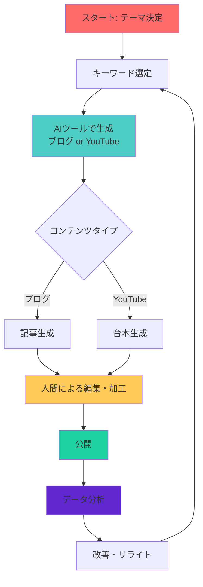

### 10.2 実践的な運用フロー（週間スケジュール）

週単位でのコンテンツ制作スケジュール例：

| 曜日 | 上午（午前） | 下午（午後） | 目的 |
|------|-------------|-------------|------|
| **月曜** | テーマ・キーワード選定<br>AIで記事3本生成 | 生成記事の確認・軽い編集 | 週間分の記事生成 |
| **火曜** | Google Docs出力・整形 | 深い編集・画像挿入 | 記事の完成度向上 |
| **水曜** | YouTube台本1本生成 | 台本の編集・撮影準備 | YouTubeコンテンツ制作 |
| **木曜** | 記事公開（2本） | アクセス数確認・コメント対応 | 公開とエンゲージメント |
| **金曜** | 記事公開（1本） | 次週のテーマ検討 | 公開と次週の準備 |
| **土曜** | データ分析<br>Search Console確認 | 人気記事のリライト検討 | パフォーマンス改善 |
| **日曜** | 次週のキーワードリスト作成 | 休憩 | 次週の準備 |

### 10.3 ブログ記事生成の詳細フロー

#### 10.3.1 準備フェーズ（5分）

```
1. テーマの決定
   ↓
   - 何について書くか明確にする
   - ターゲット読者をイメージする
   - 目的（検索流入、アフィリエイトなど）を設定

2. キーワード選定
   ↓
   - メインキーワードを決める
   - 関連キーワード（LSI）を洗い出す
   - 競合記事をチェック
```

**キーワード選定チェックリスト:**

| チェック項目 | 内容 | ツール |
|-------------|------|--------|
| 検索ボリューム | 月間100〜1000回が最適 | ラッコキーワード、Ubersuggest |
| 競合度 | 高すぎないキーワードを選ぶ | PageSpeed Insights、検索結果 |
| 意図の明確化 | 情報提供型？比較型？解決型？ | Google検索結果の上位3件 |
| 商用可能性 | アフィリエイト商品があるか | Amazon、ASPの検索 |

#### 10.3.2 AI生成フェーズ（3〜5分）

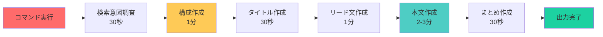

**コマンド実行:**

```bash
# 基本的な使用方法
python -m ai_writing generate "AI副業 初心者 30代会社員" --content-type blog

# クライアント設定を指定
python -m ai_writing generate "投資信託 初心者" --content-type blog --client client_a

# Google Docsに直接出力（オプション）
python -m ai_writing generate "副業 コツ" --content-type blog --output google-docs
```

**生成中の監視:**

```
AI Processing:
  ✓ 検索意図調査完了
  ✓ 構成作成完了 (5セクション)
  ✓ タイトル作成完了 (10案生成)
  ✓ リード文作成完了 (230文字)
  ■ 本文作成中... (2/5)
  □ まとめ作成 (待機)
```

#### 10.3.3 編集フェーズ（15〜30分）

**編集の優先順位:**

```
【最優先】5分でやること
├─ 事実確認: 数字・固有名詞・日付
├─ E-E-A-T強化: 経験談・専門性追加
└─ タイトル微調整: クリック率向上

【重要】10分でやること
├─ AI独特の表現を自分の言葉に書き換え
├─ 具体例・実例を追加
└─ 最新情報・ニュースを反映

【あると良い】15分でやること
├─ アフィリエイトリンクを自然に配置
├─ 画像の選定・挿入
└─ 読者への問いかけを追加
```

**E-E-A-Tチェックシート:**

| 要素 | チェック内容 | 追加例 |
|------|-------------|--------|
| **E** | 自分の経験談を追加したか？ | 「僕も実際に3ヶ月試してみたところ...」 |
| **E** | 専門的な知見を追加したか？ | 「業界で15年の経験に基づくと...」 |
| **A** | 信頼できる情報源を引用したか？ | 「Googleの公式データによると...」 |
| **T** | 事実に基づいているか？ | 数字・データを再確認 |

#### 10.3.4 公開・運用フェーズ

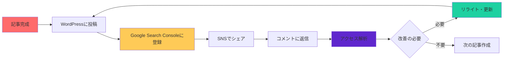

**公開後のアクション:**

| 期間 | アクション | 目的 |
|------|----------|------|
| **公開当日** | Twitter/Xでシェア<br>Facebookグループで共有 | 初期トラフィック獲得 |
| **公開3日後** | コメントに返信<br>質問があれば追記 | エンゲージメント向上 |
| **公開1週間後** | Search Consoleで検索表示回数確認<br>Google Analyticsで滞在時間確認 | パフォーマンス分析 |
| **公開2週間後** | 検索順位チェック<br>順位が低ければリライト | SEO改善 |
| **公開1ヶ月後** | 再リライト検討<br>関連記事への内部リンク追加 | 長期的なトラフィック増加 |

### 10.4 YouTube台本生成の詳細フロー

#### 10.4.1 準備フェーズ（5分）

```
1. 動画テーマの決定
   ↓
   - 視聴者に提供する価値を明確にする
   - 動画の長さ（5分/10分/15分）を決める
   - 一人語りかゆっくりかを選択

2. キーワード選定
   ↓
   - YouTubeの検索サジェストを確認
   - 競合動画を分析
   - サムネイルのアイデアを出す
```

**YouTube SEOチェック:**

| チェック項目 | 内容 | ツール |
|-------------|------|--------|
| 検索サジェスト | 実際に検索してみる | YouTube検索窓 |
| 競合動画 | 上位3件を分析 | YouTube検索結果 |
| 再生数/評価 | 需求があるか確認 | YouTube Analytics |
| トレンド | 今注目されているトピック | YouTubeトレンド |

#### 10.4.2 AI生成フェーズ（3〜5分）

```bash
# 一人語り台本
python -m ai_writing generate "犬の飼い方 初心者" --content-type youtube

# ゆっくり動画台本
python -m ai_writing generate "ChatGPT 使い方" --content-type yukkuri
```

**生成される内容:**

```
生成結果:
✓ 検索意図調査完了（視聴者ペルソナ設定）
✓ 構成作成完了（5セクション、10分対応）
✓ 冒頭・エンディング完了（フック付き）
✓ 本文作成完了（口語体、具体例あり）
✓ Google Docs出力完了
```

#### 10.4.3 編集・撮影フェーズ（30分〜2時間）

**編集のポイント:**

```
【台本編集】
├─ 冒頭5秒のフックを強化
├─ 独自のネタ・ジョークを追加
└─ アフィリエイトリンクを自然に配置

【撮影準備】
├─ サムネイル作成
├─ 照明・マイクチェック
└─ 録画環境の整備

【撮影】
├─ テイク1: 全体通して録画
├─ テイク2: 上手くいかなかった箇所のみ
└─ カット素材を追加撮影
```

**撮影のヒント:**

| 要素 | コツ | 時間短縮方法 |
|------|------|-------------|
| **照明** | 窓からの自然光を使う | 早朝・夕方がベスト |
| **音声** | マイクは口元15cmに配置 | スマホのレコーダーで確認 |
| **構図** | 顔がフレーム中央 | グリッド線を使う |
| **演技** | 自然に話すよう心がける | カメラを見ずに台本を見る |

#### 10.4.4 公開・運用フェーズ

```
公開後のスケジュール:

公開当日:
├─ 12:00 動画公開
├─ 12:05 コメント欄で挨拶
├─ 13:00 Twitter/Xでシェア
└─ 18:00 コメントに返信

公開翌日:
├─ YouTube Studioで再生数確認
├─ 視聴維持率をチェック
└─ 低いポイントを分析

公開3日後:
├─ コメントへの返信完了
├─ 関連動画へのコメント（相互促進）
└─ 次回の動画予告

公開1週間後:
├─ パフォーマンス分析
├─ 人気のセクションを特定
└─ 次の動画のテーマ検討
```

### 10.5 マルチプラットフォーム活用フロー

1つのテーマから複数のコンテンツを作成する効率的なフロー：

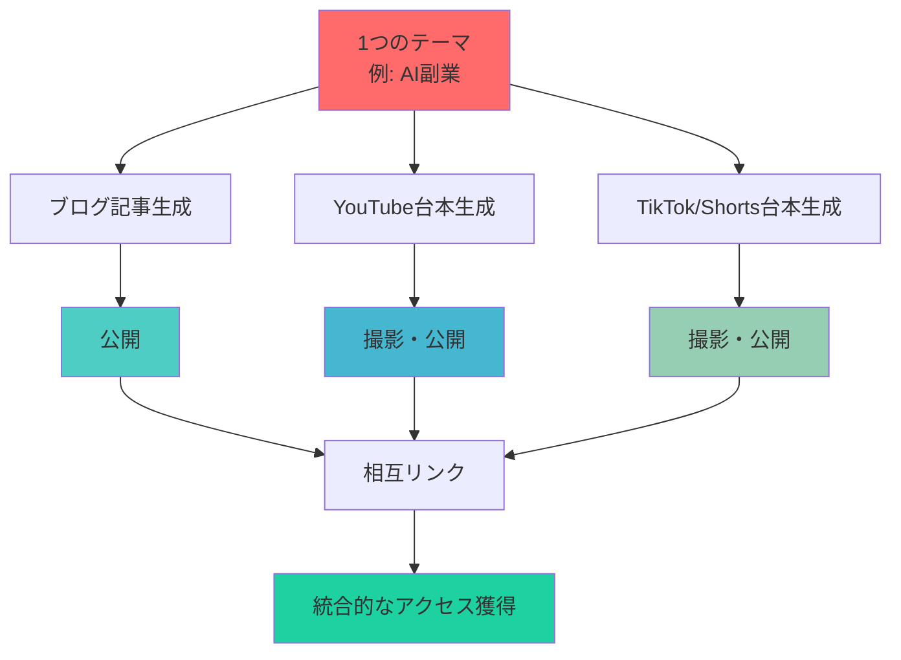

**各プラットフォームの役割:**

| プラットフォーム | 形式 | 役割 | 目的 |
|----------------|------|------|------|
| **ブログ** | テキスト記事 | SEO・詳細情報 | 検索流入・収益化 |
| **YouTube** | 動画（10〜15分） | 詳細解説 | ブランド構築・収益化 |
| **YouTube Shorts** | 動画（60秒以内） | 要約・見どころ | リーチ拡大 |
| **TikTok** | 動画（60秒以内） | ユーモア・トレンド | 若年層アプローチ |
| **Twitter/X** | テキスト・画像 | 情報共有 | コミュニティ形成 |

**実践スケジュール:**

```
月曜日:
├─ 午前: AIでブログ記事生成
├─ 午後: 記事編集

火曜日:
├─ 午前: 記事公開
└─ 午後: YouTube台本生成

水曜日:
├─ 午前: 台本編集
└─ 午後: YouTube撮影

木曜日:
├─ 午前: YouTube動画公開
└─ 午後: TikTok用Shorts編集

金曜日:
├─ 午前: TikTok/Shorts公開
└─ 午後: Twitterでまとめ投稿

週末: データ分析・次週計画
```

### 10.6 収益化までのロードマップ

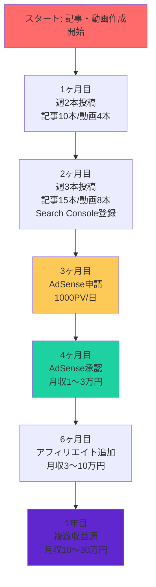

**各段階のマイルストーン:**

| 段階 | 記事数 | 動画数 | 月間PV | 月間再生 | 収益目標 |
|------|--------|--------|--------|----------|----------|
| **1ヶ月目** | 10本 | 4本 | 500 | 1,000 | 0円 |
| **2ヶ月目** | 15本 | 8本 | 2,000 | 3,000 | 0円 |
| **3ヶ月目** | 20本 | 12本 | 5,000 | 10,000 | 0円（AdSense申請） |
| **4ヶ月目** | 25本 | 16本 | 10,000 | 20,000 | 1〜3万円 |
| **6ヶ月目** | 35本 | 24本 | 30,000 | 50,000 | 3〜10万円 |
| **1年目** | 50本 | 48本 | 100,000 | 200,000 | 10〜30万円 |

### 10.7 成功の鍵：継続的な改善サイクル

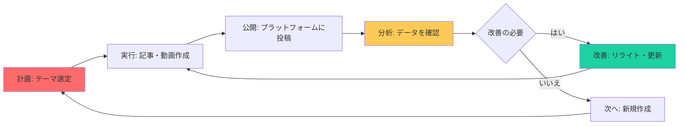

**改善サイクルのポイント:**

| サイクル | 頻度 | 何を見るか | アクション |
|---------|------|-----------|-----------|
| **日次** | 毎日 | コメント・新規フォロワー | 返信・コミュニケーション |
| **週次** | 毎週 | 再生数・PV・滞在時間 | テーマの調整 |
| **月次** | 毎月 | 検索順位・CTR | リライト・キーワード調整 |
| **四半期** | 3ヶ月ごと | トレンド・競合 | 戦略の見直し |

### 10.8 タイムマネジメントのヒント

**副業として運用する場合の時間配分:**

```
週10〜15時間の副業スケジュール:

平日（1日1時間）:
├─ 15分: ニュース・トレンドチェック
├─ 30分: 記事編集・動画撮影
└─ 15分: コメント返信・SNS

週末（5〜10時間）:
├─ 土曜（2〜3時間）:
│  ├─ 1時間: AIで週間分生成
│  └─ 1〜2時間: 深い編集・撮影
├─ 日曜（2〜3時間）:
│  ├─ 1時間: 次週の計画・キーワード選定
│  ├─ 1時間: データ分析・改善計画
│  └─ 30分: 休憩・振り返り
```

**効率化のテクニック:**

| テクニック | 内容 | 節約できる時間 |
|-----------|------|---------------|
| **一括生成** | 週末に1週間分をまとめて生成 | 週2〜3時間 |
| **テンプレート** | 記事構成・YouTube構成をテンプレート化 | 各30分 |
| **スケジュール投稿** | WordPress/YouTubeの予約投稿 | 毎日30分 |
| **バッチ処理** | 画像生成・タスクをまとめて | 週1時間 |

---

## 11. 実践編: YouTube台本を自動生成してみよう

### 11.1 一人語り台本の生成

```bash
python -m ai_writing generate "犬の飼い方" --content-type youtube
```

### 11.2 ゆっくり動画台本の生成

「霊夢」と「魔理沙」の掛け合い形式の台本を生成：

```bash
python -m ai_writing generate "犬の飼い方" --content-type yukkuri
```

### 11.3 YouTube台本の構成

```
[冒頭] 視聴者を引きつけるオープニング（フック）
  ↓ 5〜10秒
[導入] この動画で何がわかるかを説明
  ↓ 10〜20秒
[本編] 各トピックを順番に解説
  ↓ 数分〜10分以上
  - 動画の核となる情報
  - 具体的な手順
  - 注意点
[まとめ] 重要ポイントの振り返り
  ↓ 30〜60秒
[エンディング] チャンネル登録のお願いなど
  ↓ 10〜20秒
```

**YouTube台本のコツ**:
- 冒頭5秒で視聴者の興味を引く
- 早口でも聞き取れる話し方
- テロップ・図解の指示を入れる
- 次の動画への誘導を入れる

### 11.4 YouTube台本生成の詳細ワークフロー

AI Writing Automation ToolによるYouTube台本生成は、以下のパイプラインで処理されます：

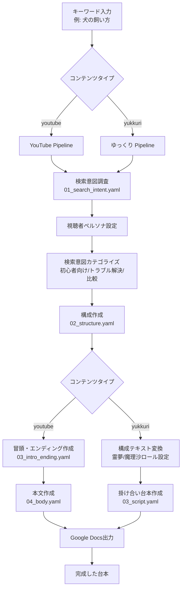

**各ステージの詳細:**

| ステージ | ファイル | 内容 |
|---------|----------|------|
| 検索意図調査 | `01_search_intent.yaml` | 視聴者ペルソナ設定、検索意図カテゴライズ、キーワード抽出 |
| 構成作成 | `02_structure.yaml` | 上位記事統合、動画目次作成（5〜7セクション、10〜20分対応） |
| 冒頭・エンディング | `03_intro_ending.yaml` | フック作成、メリット提示、チャンネル登録お願い |
| 本文作成 | `04_body.yaml` | 口語体、各セクション2000文字、具体例・比喩 |
| 掛け合い台本 | `03_script.yaml` | 霊夢・魔理沙の会話、自然な掛け合い、専門用語解説 |

### 11.5 YouTube台本の詳細な構成要素

#### 10.5.1 一人語り台本の構成

一人語り台本は、視聴者を引き込み最後まで見続けさせる構造が必要です：

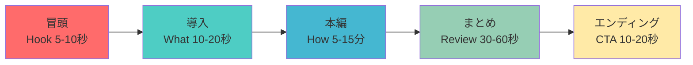

**各要素の詳細:**

| 要素 | 時間 | 目的 | 例 |
|------|------|------|-----|
| **冒頭（Hook）** | 5-10秒 | 視聴者を引き込む | 「この動画を見れば、犬の飼い方が完全に変わります」 |
| **導入（What）** | 10-20秒 | 何が得られるか | 「この動画では、初日から犬と楽しく暮らす3つのコツを紹介します」 |
| **本編（How）** | 5-15分 | 核心の情報を提供 | 手順、注意点、実例を具体的に |
| **まとめ（Review）** | 30-60秒 | 重要ポイントの振り返り | 「今日のポイントは3つです」 |
| **エンディング（CTA）** | 10-20秒 | アクションを促す | 「チャンネル登録して次の動画も見てください」 |

#### 10.5.2 ゆっくり台本の構成

ゆっくり動画は、霊夢と魔理沙の掛け合いで分かりやすく解説します：

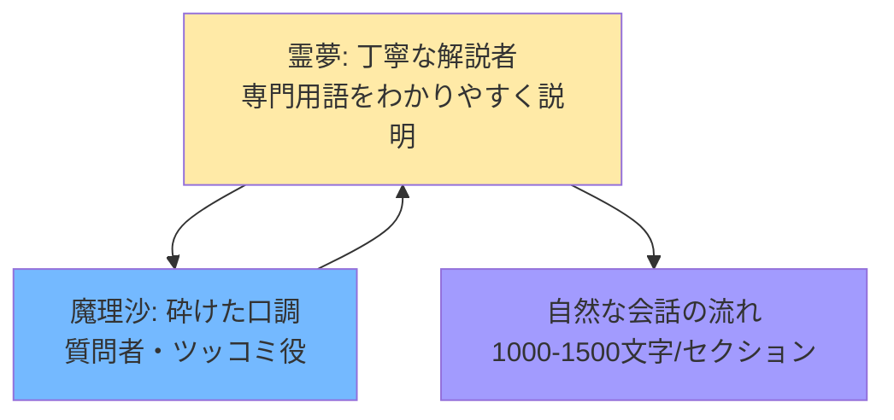

**キャラクター設定:**

| キャラクター | 口調の特徴 | 役割 | 例 |
|-------------|-----------|------|-----|
| **霊夢** | 「〜ね」「〜よ」などの語尾<br>丁寧でわかりやすい | 解説者、専門家 | 「そうですね、ここが重要なのです」 |
| **魔理沙** | 「〜だぜ」「〜なのだ」などの語尾<br>少し砕けた | 質問者、ツッコミ役 | 「え？それはどういうことだぜ？」 |

### 11.6 プロンプトカスタマイズ

YouTube台本の生成をカスタマイズするには、`prompts/youtube/` フォルダ内のYAMLファイルを編集します。

#### 10.6.1 視聴者ペルソナの設定（`01_search_intent.yaml`）

```yaml
# prompts/youtube/01_search_intent.yaml

system: |
  あなたはYouTube動画のプロデューサーです。
  特にテクノロジー系コンテンツに精通しています。

user: |
  「{{keyword}}」というキーワードでYouTube動画を作成します。
  
  #ペルソナ設定（カスタマイズ例）
  年齢: 20-30代
  性別: 男性70%、女性30%
  職業: エンジニア、プログラマー、IT系学生
  状況: AIや新しい技術に興味がある
  目標: AIを使って効率的に仕事をこなしたい
  
  このキーワードの検索意図をグルーピングしてください。

  #制約条件
  ・検索意図をカテゴライズする（例：初心者向け、中級者向け、トラブル解決、比較など）
  ・それぞれの意図に含まれる具体的なキーワードを3つずつ挙げる
  ・視聴者の属性を考慮する
```

#### 10.6.2 動画構成の調整（`02_structure.yaml`）

```yaml
# prompts/youtube/02_structure.yaml

user: |
  「{{keyword}}」というキーワードでYouTube動画を作成します。
  
  #制約条件（カスタマイズ例）
  ・10分〜20分の動画に適した構成にする（5〜7つのセクション）
  ・各セクションは2000文字程度の目安
  ・視聴者が最後まで見たくなるような流れを意識する
  
  #動画構成のポイント（追加）
  ・冒頭に強力なフックを入れる
  ・中盤に実践的な手順やデモを入れる
  ・終盤にQ&Aやトラブル解決を入れる
  ・最後にまとめと次回への期待を持たせる
```

#### 10.6.3 冒頭・エンディングの強化（`03_intro_ending.yaml`）

```yaml
# prompts/youtube/03_intro_ending.yaml

user: |
  「{{keyword}}」というキーワードでYouTube動画を作成します。
  
  #制約条件（カスタマイズ例）
  ・冒頭は視聴者を引き込むフックを含める
  ・冒頭には本動画で得られる3つのメリットを明確に伝える
  ・エンディングはチャンネル登録をお願いする
  ・エンディングには次の動画の予告を含める
  
  #フックの例（追加）
  ・「この動画を見る前に知っておいてほしいことがあります」
  ・「〇〇について検索したことありますか？実は間違っているんです」
  ・「たった〇〇分で〇〇ができる方法を教えます」
```

#### 10.6.4 本文のトーン調整（`04_body.yaml`）

```yaml
# prompts/youtube/04_body.yaml

user: |
  「{{keyword}}」というキーワードでYouTube動画を作成します。
  
  #制約条件（カスタマイズ例）
  ・口語体で書く（「〜ですね」「〜でしょう」等）
  ・各セクションは2000文字程度
  ・視聴者が理解しやすいように具体例や比喩を使う
  ・専門用語はわかりやすく説明する
  
  #トーンの例（追加）
  ・親しみやすい: 「ですね」「ましょう」を多用
  ・プロフェッショナル: 「と考えられます」「重要です」を多用
  ・エンタメ性重視: 驚き、疑問、興味を引き出す表現を多用
```

### 11.7 収益化統合

YouTube台本を収益化に活かすための戦略：

#### 10.7.1 YouTubeパートナープログラム（YPP）

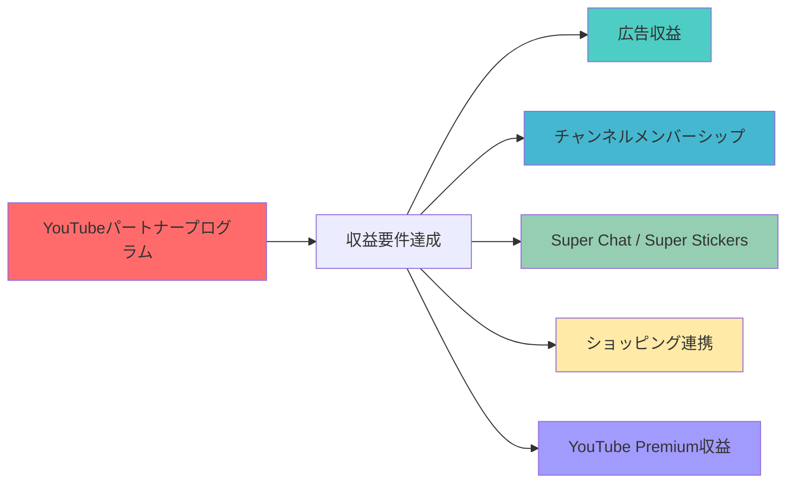

**収益要件（2025年基準）:**
- 12ヶ月間の再生時間: 4,000時間以上
- フォロワー数: 1,000人以上

#### 10.7.2 アフィリエイトリンクの台本配置

台本内で自然なアフィリエイトリンクを誘導：

| 配置タイミング | 表現例 | 注意点 |
|---------------|--------|--------|
| **導入後** | 「この動画で紹介するツールは、以下のリンクから...」 | 自然な流れで |
| **本編中** | 「この手順で使う道具はこれです。詳細は概要欄で...」 | 関連性を強調 |
| **まとめ** | 「まとめると、この商品が最適です。リンクは概要欄に...」 | 再確認で強化 |

**台本に含めるアフィリエイト表現例:**

```
[導入]
「この動画で紹介するサービスは、僕も実践しているもので、
 実際に月5万円の副収入を実現しています」

[本編]
「このツールの詳細は、概要欄のリンクから確認できます。
 初回登録で特典があるので、ぜひチェックしてみてください」

[まとめ]
「今日紹介したサービスは、以下のリンクから無料で試せます。
 僕の感想を交えてレビューしているので、参考にしてください」
```

#### 10.7.3 Super Chat / Super Stickers 最適化

ライブ配信やPremiereでSuper Chatを最大化する台本構成：

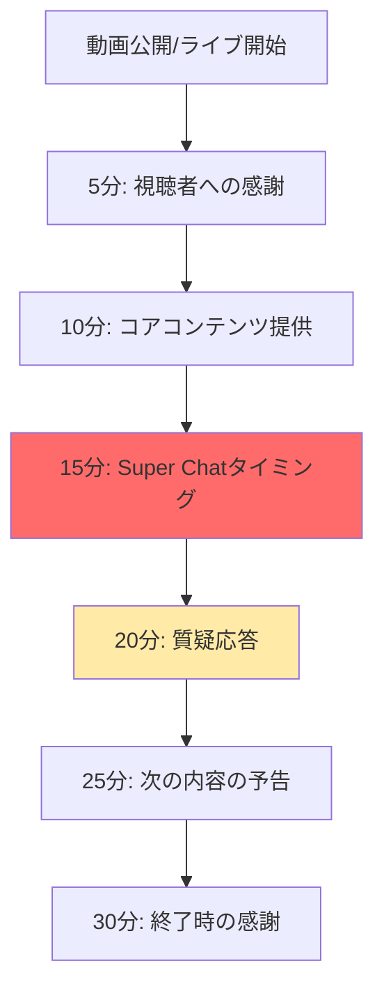

**Super Chatタイミング:**
- コア情報提供後：「この動画が参考になったらSuper Chatで応援してください」
- 質疑応答中：「コメント欄で質問を受け付けます。Super Chatで優先回答します」

### 11.8 実践例：実際の台本生成

キーワード「AI副業」でYouTube台本を生成した例：

#### 10.8.1 生成された構成（例）

```
{
  "structure": [
    {
      "section": "AI副業で月5万円稼ぐ方法",
      "description": "AIツールを使った具体的な副業方法を紹介",
      "estimated_time": "2分"
    },
    {
      "section": "AIライティングの基本",
      "description": "ChatGPTなどのAIツールの使い方",
      "estimated_time": "3分"
    },
    {
      "section": "実際に稼いだ実例紹介",
      "description": "月5万円達成までの具体的なステップ",
      "estimated_time": "4分"
    },
    {
      "section": "失敗しないための注意点",
      "description": "AI活用でよくある間違い",
      "estimated_time": "3分"
    },
    {
      "section": "次のステップ：月10万円への道",
      "description": "さらなる収益化の方法",
      "estimated_time": "3分"
    }
  ]
}
```

#### 10.8.2 生成された冒頭（例）

```
[冒頭]
「この動画を見れば、AIを使って月5万円を稼ぐ方法が完全にわかります。
 ただ見るだけではなく、今日から実践できる具体的な手順を紹介します」

[導入]
「この動画では、AIを使った副業で月5万円を達成する5つのステップを紹介します。
 特に、会社員の方でも週末だけできる方法にフォーカスします」
```

#### 10.8.3 生成された本文の一部（例）

```
[本文：AIライティングの基本]
「では、まずAIライティングの基本から始めましょう。
 ChatGPTなどのAIツールを使うと、記事作成の効率が劇的に上がります。

 具体的には、キーワードを入力するだけで構成案が作成できます。
 例えば『AI副業』と入力すると、検索意図に基づいた構成が出てきます。

 ここがポイントです。AIが出力した構成は、あくまでたたき台です。
 自分の経験や専門知識を加えることで、オリジナリティが出ます」
```

### 11.9 トラブルシューティング

#### Q1. YouTube台本が動画の長さに合わない

**原因**: セクション数や文字数設定が不適切

**解決方法**:
```yaml
# prompts/youtube/02_structure.yaml で調整
・5分動画: 3-4セクション
・10分動画: 5-6セクション
・15分以上: 7-8セクション
・各セクションは1000-1500文字程度（5分動画の場合）
```

#### Q2. 台本のトーンが視聴者に合わない

**原因**: ペルソナ設定がずれている

**解決方法**:
```yaml
# prompts/youtube/01_search_intent.yaml でペルソナ調整
# ビジネス層向け: プロフェッショナルなトーン
# エンタメ層向け: カジュアルで面白いトーン
# 専門層向け: 専門用語を交えた詳細な解説
```

#### Q3. ゆっくり台本の会話が不自然

**原因**: キャラクター設定が十分ではない

**解決方法**:
```yaml
# prompts/yukkuri/03_script.yaml で強化
霊夢:
・丁寧語を多用（「です」「ですね」「ましょう」）
・専門用語を丁寧に説明
・魔理沙の質問にゆっくり答える

魔理沙:
・砕けた口調（「だぜ」「なのだ」）
・素朴な疑問を投げかける
・霊夢の説明にツッコミを入れる
```

### 11.10 成功のポイント

YouTube台本生成で成果を出すためのポイント：

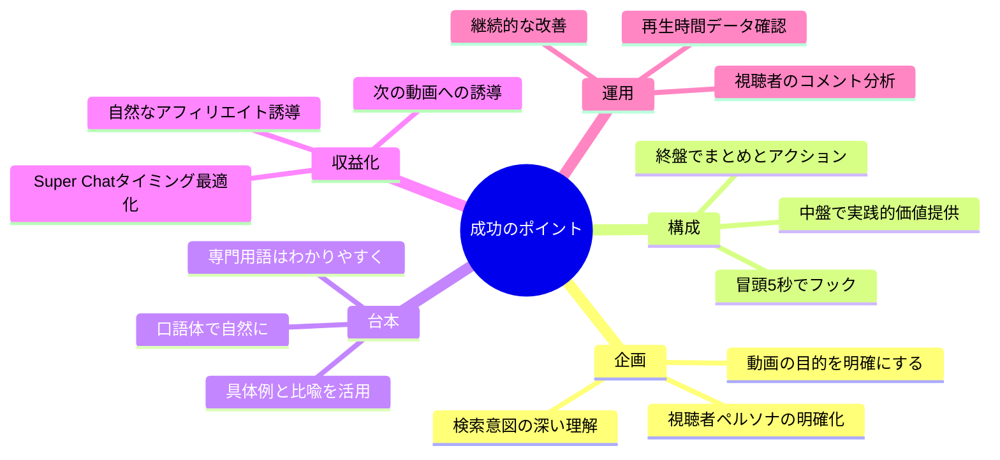

### 11.11 YouTubeチャンネル運営への応用

AI Writing Automation Toolは、単一の動画生成だけでなく、チャンネル全体の運営戦略にも活用できます。

#### 10.11.1 コンテンツカレンダー作成

YouTubeチャンネルを継続的に運営するためのコンテンツカレンダーを自動生成：

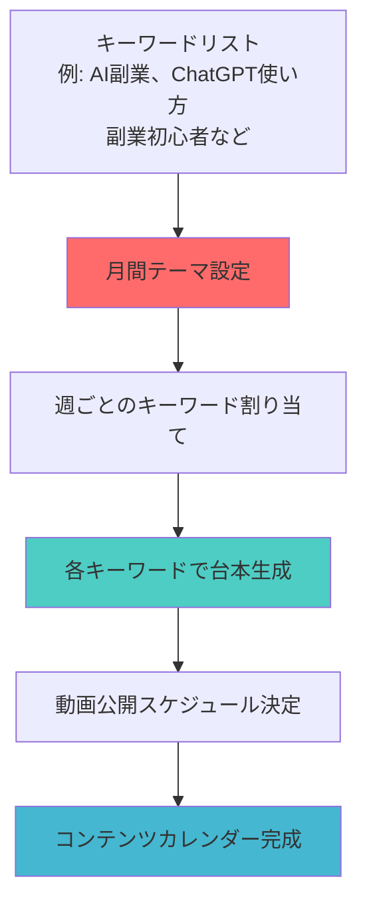

**週間コンテンツ構成の例:**

| 曜日 | コンテンツタイプ | 目的 | 例 |
|------|----------------|------|-----|
| 月曜 | 基礎編 | チャンネル登録者獲得 | 「AI副業の始め方」 |
| 水曜 | 応用編 | エンゲージメント強化 | 「ChatGPTで月5万円稼ぐ方法」 |
| 金曜 | Q&A / ライブ | コミュニティ形成 | 「ライブで質問に回答します」 |

**一括生成コマンドの例:**

```bash
# 月間コンテンツ（12本分）を一括生成
for keyword in "AI副業の始め方" "ChatGPT使い方" "副業初心者" "AIライティング" \
                "副業収入" "ChatGPTビジネス" "AIツール比較" "副業コツ" \
                "AI副業成功事例" "副業時間管理" "ChatGPT活用" "AI副業スクール"; do
  python -m ai_writing generate "$keyword" --content-type youtube
done
```

#### 10.11.2 シリーズ動画の戦略的展開

視聴者を惹きつけるシリーズ動画を体系的に展開：

```mermaid
graph LR
    A[第1回<br>入門編<br>チャンネル登録獲得] --> B[第2回<br>基礎編<br>視聴維持率向上]
    B --> C[第3回<br>応用編<br>エンゲージメント強化]
    C --> D[第4回<br>実践編<br>収益化開始]
    D --> E[第5回<br>上級編<br>コミュニティ形成]

    style A fill:#ff6b6b
    style B fill:#feca57
    style C fill:#48dbfb
    style D fill:#1dd1a1
    style E fill:#5f27cd
```

**「AI副業」シリーズの構成例:**

| 回 | タイトル | 内容 | 目的 |
|----|--------|------|------|
| 第1回 | AI副業の始め方 | 準備、ツール紹介、最初の一歩 | チャンネル登録者獲得 |
| 第2回 | ChatGPTで記事作成 | 具体的な使い方、テンプレート | 視聴維持率向上 |
| 第3回 | 月5万円稼ぐ方法 | 実践的な収益化戦略 | エンゲージメント強化 |
| 第4回 | 失敗しないコツ | よくある間違い、トラブル解決 | 信頼性構築 |
| 第5回 | 次のステップ | 月10万円への道、専門化 | 継続視聴促進 |

**シリーズ動画用プロンプトのカスタマイズ:**

```yaml
# prompts/youtube/02_structure.yaml（シリーズ用）
user: |
  この動画は「AI副業」シリーズの第2回です。
  
  #シリーズ全体の構成
  第1回: AI副業の始め方（準備、ツール）
  第2回: ChatGPTで記事作成（今回）
  第3回: 月5万円稼ぐ方法（実践）
  第4回: 失敗しないコツ（トラブル解決）
  第5回: 次のステップ（応用）
  
  #今回の動画のポイント
  ・前回の続きであることを明示
  ・次回への期待感を持たせる
  ・視聴者が「続きを見たい」と思う構成にする
```

#### 10.11.3 YouTube SEO最適化

台本生成時にYouTube SEOを意識した構成：

```mermaid
graph TD
    A[キーワード選定<br>検索ボリューム>1000<br>競合度: 中〜低] --> B[タイトル作成<br>キーワードを先頭に<br>クリック率重視]
    B --> C[概要欄最適化<br>キーワードを含む<br>タイムスタンプ付き]
    C --> D[タグ設定<br>関連キーワード<br>競合タイトルの分析]
    D --> E[サムネイル最適化<br>顔出し+テキスト<br>鮮やかな色使い]
    E --> F[台本構成<br>キーワードを含む<br>視聴維持率重視]

    style A fill:#ff6b6b
    style C fill:#4ecdc4
    style F fill:#45b7d1
```

**YouTube SEOチェックリスト:**

| 項目 | チェック内容 | 重要性 |
|------|-------------|--------|
| **タイトル** | キーワードが先頭にあるか？60文字以内か？ | ⭐⭐⭐⭐⭐ |
| **概要欄** | キーワードが含まれているか？200文字以上あるか？ | ⭐⭐⭐⭐ |
| **タグ** | メインキーワード+関連キーワードが5〜10個あるか？ | ⭐⭐⭐ |
| **サムネイル** | クリックしたくなるか？文字が読めるか？ | ⭐⭐⭐⭐⭐ |
| **台本** | 冒頭5秒でフックがあるか？最後まで見たくなるか？ | ⭐⭐⭐⭐⭐ |

**SEO最適化されたタイトル生成例:**

```bash
# タイトルを含めて生成する場合
python -m ai_writing generate "AI副業 初心者" --content-type youtube \
  --title "【完全保存版】AI副業の始め方！初心者が月5万円稼ぐ3つのステップ"

# サムネイル用キーワードも抽出
python -m ai_writing generate "AI副業" --content-type youtube \
  --extract-thumbnail-keywords
```

#### 10.11.4 視聴者エンゲージメント強化

視聴者とのつながりを深めるための台本戦略：

```mermaid
graph LR
    A[コメント欄活用<br>質問に回答<br>次の動画のアイデア募集] --> B[コミュニティ投稿<br>限定情報配信<br>裏話の共有]
    B --> C[ライブ配信<br>リアルタイムQ&A<br>視聴者との対話]
    C --> D[プレミア公開<br>コメントチャット<br>視聴者とのつながり]
    D --> E[コラボ動画<br>視聴者層の拡大<br>相互フォロー]

    style A fill:#ff6b6b
    style C fill:#4ecdc4
    style E fill:#45b7d1
```

**視聴者エンゲージメントを高める台本要素:**

| 要素 | 内容 | 台本への組み込み方 |
|------|------|-------------------|
| **質問投げかけ** | 視聴者に質問する | 「あなたはどう考えますか？コメントで教えてください」 |
| **投票・アンケート** | 次回のテーマを決定 | 「次はどのテーマが見たいですか？」 |
| **コメントへの言及** | 過去のコメントを紹介 | 「以前のコメントでいただいた質問に答えます」 |
| **裏話の共有** | 作り込みの裏側 | 「実はこの動画の撮影で...」 |
| **プレゼント企画** | コメントで応募 | 「チャンネル登録してコメントで応募」 |

#### 10.11.5 収益化ロードマップ

YouTubeチャンネルの収益化までの具体的なステップ：

```mermaid
graph TD
    A[開始<br>チャンネル作成<br>第1回動画公開] --> B[1ヶ月目<br>週2本投稿<br>視聴者100人達成]
    B --> C[3ヶ月目<br>週3本投稿<br>視聴者500人達成<br>月間再生時間1000時間]
    C --> D[6ヶ月目<br>週3本投稿<br>視聴者1000人達成<br>月間再生時間4000時間]
    D --> E[YPP申請<br>審査待ち]
    E --> F[YPP承認<br>広告収益開始]
    F --> G[1年目<br>月収1〜3万円<br>アフィリエイト追加]
    G --> H[2年目<br>月収3〜10万円<br>コミュニティ形成]
    H --> I[3年目<br>月収10〜50万円<br>ブランド化]

    style A fill:#ff6b6b
    style D fill:#feca57
    style F fill:#1dd1a1
    style I fill:#5f27cd
```

**収益化ステージ別の戦略:**

| ステージ | 視聴者数 | 再生時間 | 戦略 |
|---------|---------|----------|------|
| **初期（0-100人）** | 0-100 | 0-50時間/月 | コンテンツ量重視、SEO対策、タイトル改善 |
| **成長期（100-1000人）** | 100-1000 | 50-1000時間/月 | 週3本投稿、エンゲージメント強化、シリーズ展開 |
| **YPP申請期（1000人）** | 1000+ | 1000-4000時間/月 | 視聴維持率向上、コメント活動、ライブ配信 |
| **収益化初期（承認後）** | 1000-5000 | 4000-10000時間/月 | アフィリエイト追加、Super Chat活用、メンバーシップ |
| **拡張期（5000人+）** | 5000+ | 10000+時間/月 | コラボ動画、ブランド化、複数収益源 |

**AI台本活用による効率化:**

- **初期**: 毎週3本の動画台本をAIで自動生成 → 人間は撮影・編集に集中
- **成長期**: シリーズ動画の台本を一括生成 → 全体のストーリーを一貫
- **YPP申請期**: 視聴維持率を重視した台本構成 → データに基づく改善
- **収益化初期**: アフィリエイトを自然に組み込んだ台本 → 収益最大化

### 11.12 ベストプラクティス

#### 10.12.1 よくある失敗と対策

| 失敗 | 原因 | 対策 |
|------|------|------|
| **再生時間が伸びない** | 冒頭が長い、フックがない | 冒頭5秒で視聴者を引き込む構成 |
| **コメントがつかない** | 視聴者への問いかけがない | 質問投げかけ、コメントでの回答を台本に含める |
| **チャンネル登録が増えない** | 次の動画への誘導がない | エンディングでチャンネル登録のお願いを明確に |
| **収益化できない** | 広告収益だけに依存 | アフィリエイト、Super Chat、メンバーシップを組み合わせ |
| **台本が長すぎる** | セクションが多すぎる | ターゲット動画長に合わせてセクション数を調整 |

#### 10.12.2 成功チャンネルの共通点

```mermaid
mindmap
  root((成功チャンネルの共通点))
    コンテンツ
      明確なニッチ
      持続可能な投稿頻度
      独自の切り口
    運用
      視聴者との対話
      コメントへの返信
      コミュニティ形成
    成長
      データに基づく改善
      動画のA/Bテスト
      トレンドへの適応
    収益化
      複数の収益源
      自然なアフィリエイト
      視聴者への価値提供優先
```

---

## 12. トラブルシューティング・よくある質問

### Q1. 「'python' は認識されていません」というエラーが出る

**原因**: PythonがPATHに追加されていない

**解決方法**:
1. Pythonを再インストール
2. インストール時に「Add Python to PATH」にチェックを入れる
3. PCを再起動

### Q2. APIキーのエラーが出る

**原因**: APIキーが正しく設定されていない

**確認ポイント**:
- `.env` ファイルが存在するか
- APIキーの前後に余分なスペースがないか
- `sk-` で始まっているか（OpenAIの場合）
- クレジット残高が十分か

### Q3. 「Rate limit exceeded」と表示される

**原因**: 短時間にAPIを使いすぎた

**解決方法**:
- 数分待ってから再実行
- OpenAIの利用上限を確認・増額
- モデルを安価なものに切り替え（GPT-4 → GPT-3.5）

### Q4. 生成される文章の品質が低い

**改善方法**:
- より具体的なキーワードを使う（「AI副業」→「AI副業 30代会社員 2024」）
- クライアント設定でトーンを調整
- 生成後に人間が編集・ブラッシュアップ（最重要！）
- 複数回生成して良い方を選ぶ

### Q5. 処理が途中で止まる

**確認ポイント**:
- インターネット接続を確認
- APIの残高を確認（クレジット切れの可能性）
- エラーメッセージを確認
- トークン制限を確認（`config/config.yaml`の`max_tokens`設定）

### Q6. 仮想環境が有効化できない

**Windowsの場合**:
PowerShellで実行権限のエラーが出る場合：

```powershell
Set-ExecutionPolicy -ExecutionPolicy RemoteSigned -Scope CurrentUser
```

上記を実行後、再度 `.venv\Scripts\activate` を試す。

### Q7. Google Docsへの出力がうまくいかない

**確認ポイント**:
- `credentials.json` が正しく設定されているか
- Google Docs APIが有効化されているか
- Google Drive APIが有効化されているか
- 最初の実行時はブラウザ認証が必要（ポップアップを許可）

---

## 13. 発展的な使い方・カスタマイズ

### 12.1 クライアント別設定の作成

複数のクライアントや用途に応じた設定を作成できます。

`config/clients/` フォルダに新しいYAMLファイルを作成：

```yaml
# config/clients/blog_casual.yaml
client:
  name: "カジュアルブログ"
  
content:
  type: "blog"
  
tone:
  formality: "casual"  # casual または formal
  target_age: "20s"
  voice: "friendly"
  
seo:
  keyword_density: 1.5  # キーワード密度(%）
  readability_score: 7.0  # 読みやすさスコア
```

使用時：

```bash
python -m ai_writing generate "AI副業" --client blog_casual
```

### 12.2 画像生成の設定

`config/config.yaml` で画像生成をカスタマイズ：

```yaml
image_insertion:
  after_h2: true       # h2見出しの後に画像を挿入
  after_lead: true     # リード文の後に画像を挿入
  before_summary: false # まとめの前には挿入しない
  custom_positions:
    - after: "h2:2"  # 2つ目のh2の後にも挿入

image_generation:
  provider: "dalle"   # dalle, gemini, midjourney
  style: "natural"      # natural, anime, realistic
  size: "1024x1024"
```

### 12.3 プロンプトのカスタマイズ

`prompts/blog/` フォルダ内のYAMLファイルを編集することで、
AIへの指示（プロンプト）をカスタマイズできます。

**注意**: プロンプトの変更は上級者向けです。
バックアップを取ってから編集することをおすすめします。

**プロンプトカスタマイズの例**:

```yaml
# prompts/blog/01_search_intent.yaml

system: |
  あなたはSEOの専門家であり、プロのWebライターです。
  10年以上の実績を持ち、Googleの最新アルゴリズムを理解しています。

user: |
  「{{keyword}}」というキーワードでSEO記事を書きます。
  
  #ペルソナ設定
  年齢: 35歳
  性別: 男性
  職業: 会社員
  年収: 450万円
  状況: 副業に興味あり、AI初心者
  目標: 月5万円の副収入
  
  #制約条件
  ・日本語で出力してください
  ・PREP法を意識して書いてください
  ・一文は60文字以内にしてください
  ・専門用語は説明を添えてください
  ・具体例を2つ以上入れてください
  
  #SEO条件
  ・キーワードは適切な密度で（1〜2%）含めてください
  ・LSIキーワード（関連語）も含めてください
  
  #出力形式
  以下のJSON形式で出力してください：
  ```json
  {
    "persona": "ペルソナの説明",
    "needs_explicit": ["顕在ニーズ1", "顕在ニーズ2"],
    "needs_latent": ["潜在ニーズ1", "潜在ニーズ2"]
  }
  ```

output_parser: "json"
```

---

## 14. AI時代のライター生存戦略

### 13.1 AIの台頭で変わったこと

**2023-2025年の急激な変化**:
- ChatGPT（2022年12月）→ GPT-4o（2025年）: 能力が爆発的に向上
- AIコンテンツの爆発: コンテンツの供給過多
- Googleの対応: AI Overview導入、Helpful Content Update
- ライターへの影響: 単価の低下、AI使用の必須化

### 13.2 AIに淘汰されないために必要なこと

**AIが苦手なこと**:
1. **実際の経験**: 実体験したことはAIには書けない
2. **感情的な表現**: 読者の感情を動かす文章
3. **複雑な文脈**: 複数の情報を組み合わせた洞察
4. **最新の情報**: ニュース・トレンドの即時反映
5. **独自の視点**: 他にはない切り口

**ライターの強化すべきスキル**:

| スキル | 重要度 | AI代替可能性 |
|--------|---------|---------------|
| 実際の経験 | ★★★★★ | ×（困難） |
| 感情表現 | ★★★★☆ | △（可能だが平面的） |
| ニュース感覚 | ★★★★☆ | ×（困難） |
| インタビュー能力 | ★★★★☆ | ×（困難） |
| 構成力 | ★★★☆☆ | ○（AIが得意） |
| 事実確認 | ★★★☆☆ | ○（可能） |
| SEO知識 | ★★☆☆☆ | ○（可能） |
| 編集能力 | ★★☆☆☆ | ○（AIが得意） |

### 13.3 AI×人間の協働モデル

```
──────────────────────────────────────
     あなた（人間）            AI
──────────────────────────────────────
          ↑                      ↑
          │                      │
    構成・視点・経験      文章生成・情報整理
          │                      │
          └──────→ 編集 ←──────┘
                     ↓
                高品質なコンテンツ
                     ↓
                  SEO評価アップ
                     ↓
                   収益化実現
──────────────────────────────────────
```

**推奨ワークフロー**:

1. **企画**: キーワード・ペルソナ・構成を自分で決める
2. **生成**: AIに下書きを生成させる
3. **編集**: 自分の経験・視点を追加
4. **事実確認**: 数字・情報をチェック
5. **最終化**: 独自性を担保

### 13.4 2025年以降のライターの価値

「文章を書く」だけの価値は低下しました。

**2025年以降に価値があるライター**:
1. **コンサル型ライター**: 企画・戦略・分析を提供
2. **専門家型ライター**: 深い専門知識を持つ
3. **経験型ライター**: 実体験を共有する
4. **編集型ライター**: AI生成物を高品質に仕上げる
5. **プロデューサー**: コンテンツ全体を設計・管理

### 13.5 今後のスキルアップの方向性

```
今すぐ始められること:
├─ AIツールの使い方をマスター
├─ SEOの最新トレンドを学ぶ
├─ E-E-A-Tを意識した記事を書く
└─ 自分の専門分野を決める

中期的に取り組むこと:
├─ 1〜2つの専門分野を深掘り
├─ 実際の経験を積み重ねる
├─ ニュースの感覚を養う
├─ インタビュー・取材スキルを学ぶ
└─ ポートフォリオを充実させる

長期的に目指すこと:
├─ 業界での権威性を築く
├─ 書籍・講師などの活動
├─ コンテンツ運営のコンサルティング
└─ チーム・組織のマネジメント
```

---

## 15. 用語集

| 用語 | 読み方 | 意味 |
|------|--------|------|
| AI | エーアイ | 人工知能。人間の知能を模倣するプログラム |
| API | エーピーアイ | プログラム同士が通信するための仕組み |
| ChatGPT | チャットジーピーティー | OpenAI社の会話型AI |
| CLI | シーエルアイ | コマンドラインインターフェース。文字で操作する方式 |
| Git | ギット | プログラムのバージョン管理ツール |
| LLM | エルエルエム | 大規模言語モデル。文章を生成するAI |
| Python | パイソン | プログラミング言語の一種 |
| SEO | エスイーオー | 検索エンジン最適化 |
| E-E-A-T | イーイーエーティー | 経験・専門性・権威性・信頼性 |
| PREP法 | プレップほう | 文章構成法（結論→理由→例→結論） |
| SDS法 | エスディーエスほう | 文章構成法（要約→詳細→要約） |
| ペルソナ | ぺるそな | 想定読者の具体的なプロフィール |
| プロンプト | ぷろんぷと | AIへの指示文 |
| プロンプトエンジニアリング | - | AIから最適な回答を引き出す技術 |
| ハルシネーション | はるしねーしょん | AIが事実と異なることを自信を持って述べる現象 |
| 顕在ニーズ | けんざいにーず | ユーザーが認識している明確な欲求 |
| 潜在ニーズ | せんざいにーず | ユーザー自身も気づいていない深層の欲求 |
| 仮想環境 | かそうかんきょう | プロジェクト専用の隔離された作業空間 |
| トークン | とーくん | AIが処理する文章の単位（約1〜2文字） |
| AI Overview | - | Googleの検索結果に表示されるAI要約 |
| AdSense | アドセンス | Googleの広告配信サービス |
| ASP | - | アフィリエイト・サービス・プロバイダー |
| LSI | エルエスアイ | 潜在的意味索引。関連キーワードのこと |

---

## おわりに

このガイドを最後まで読んでいただき、ありがとうございます！

AI ライティング自動化ツールを使いこなすことで、あなたのWebライター・副業ライフが大きく変わるはずです。

ただし、何度も強調しますが：

> **AIは「ツール」であり、「代替」ではありません。**

AIが生成した文章を土台に、あなた自身の経験や視点を加えることで、
真に価値のあるコンテンツが生まれます。

**2025年のSEOで成功するためには**:
1. AIを効率的に活用する
2. 人間の経験・視点を加える
3. E-E-A-Tを高める
4. 最新情報をキャッチアップする
5. 読者のベネフィットを最大化する

まずは1本、記事を生成してみてください。
そして、編集・改善を重ねながら、自分だけのワークフローを見つけてください。

あなたの副業成功を応援しています！

---

**更新履歴**
- 2025年1月: 初版作成（2024-2025年のSEO・ライティング・AIトレンドを網羅）

**お問い合わせ**
- GitHub Issues: https://github.com/tndg16-bot/ai-writing-automation/issues
