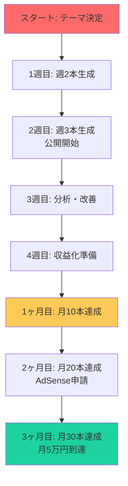
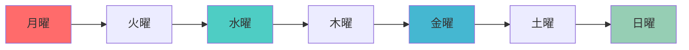

# 収益化実践チュートリアル - 月5万円を稼ぐまでのステップ

**AIライティング自動化ツールを使って、副業で月5万円を稼ぐための具体的な手順**

---

## 📋 チュートリアル概要

| 項目 | 内容 |
|------|------|
| **目標** | 月5万円の副収入を達成する |
| **期間** | 1ヶ月〜3ヶ月 |
| **前提条件** | AIライティング自動化ツールのセットアップ完了 |
| **想定読者** | 副業初心者、会社員 |

---

## 🎯 月5万円到達のロードマップ



---

## 🗓️ 週間スケジュール（週10〜15時間）

### 月曜日（2時間）

```
午前（1時間）:
├─ ニュース・トレンドチェック
│  └─ Googleトレンド、Twitter検索
├─ テーマ・キーワード選定
│  └─ 今週の3つのテーマを決める
└─ ツールで週間分の記事を生成
   └─ python -m ai_writing generate "テーマ" --content-type blog

午後（1時間）:
├─ 生成記事の確認・軽い編集
└─ 週間の計画を立てる
```

**目標**: 今週の3つのテーマを決定し、記事生成を完了

### 火曜日（1時間）

```
午前（30分）:
└─ 2本目の記事を深く編集
   ├─ 事実確認
   ├─ 経験談の追加
   └─ 専門性の補強

午後（30分）:
├─ Google Docs出力・整形
└─ WordPressに保存（下書き）
```

**目標**: 2本目の記事を完成度80%まで

### 水曜日（1時間）

```
午前（30分）:
└─ YouTube台本生成
   └─ python -m ai_writing generate "テーマ" --content-type youtube

午後（30分）:
├─ 台本編集
└─ 撮影準備
```

**目標**: YouTube台本を生成し、撮影準備完了

### 木曜日（2時間）

```
午前（1時間）:
├─ 記事公開（1〜2本）
└─ アクセス数確認

午後（1時間）:
├─ コメントへの返信
└─ 次のテーマ検討
```

**目標**: 記事を公開し、アクセス数を確認

### 金曜日（2時間）

```
午前（1時間）:
└─ 残りの記事公開

午後（1時間）:
├─ 今週の振り返り
└─ 次週の計画
```

**目標**: 今週の全記事を公開し、来週の計画を立てる

### 土曜日（2〜3時間）

```
午前（1時間）:
├─ YouTube動画撮影・編集
└─ 動画公開

午後（1〜2時間）:
├─ Search Console確認
├─ Google Analytics確認
└─ 人気記事のリライト検討
```

**目標**: YouTube動画を公開し、データを分析

### 日曜日（1時間）

```
午前（30分）:
└─ 次週のキーワードリスト作成

午後（30分）:
├─ 収益の確認
└─ 休憩・振り返り
```

**目標**: 来週の準備完了、リフレッシュ

---

## 📊 週間成果目標

| 週 | 記事数 | 動画数 | 月間PV | 月間再生 | 収益目標 |
|----|--------|--------|--------|----------|----------|
| **1週目** | 2本 | 0本 | 500 | 0 | 0円 |
| **2週目** | 3本 | 0本 | 800 | 0 | 0円 |
| **3週目** | 3本 | 1本 | 1,200 | 100 | 0円 |
| **4週目** | 3本 | 1本 | 2,000 | 500 | 0円（AdSense準備） |
| **5週目** | 4本 | 2本 | 3,500 | 1,000 | 0円（AdSense申請） |
| **6週目** | 4本 | 2本 | 5,000 | 2,000 | 0円（AdSense審査待ち） |
| **7週目** | 5本 | 3本 | 8,000 | 3,000 | 1〜3万円（承認後） |
| **8週目** | 5本 | 3本 | 12,000 | 5,000 | 2〜4万円 |
| **12週目** | 6本 | 4本 | 30,000 | 15,000 | 4〜6万円 |

---

## 🎓 第1週目：準備と初歩的実践

### 目標
- 週2本の記事を生成
- 記事編集に慣れる
- 公開の流れを理解する

### 具体的なステップ

#### 月曜日

1. **ニュース・トレンドチェック（15分）**
   ```
   - Googleトレンドを確認
   - Twitterのトレンドハッシュタグを確認
   - 関連するニュースを3つピックアップ
   ```

2. **テーマ・キーワード選定（30分）**
   ```
   今週のテーマ例:
   1. 「AI副業 初心者 2024」
   2. 「副業 時間がない 会社員」
   ```

3. **ツールで記事生成（15分）**
   ```bash
   python -m ai_writing generate "AI副業 初心者 2024" --content-type blog
   python -m ai_writing generate "副業 時間がない 会社員" --content-type blog
   ```

4. **記事確認・軽い編集（30分）**
   ```
   - 生成された記事を読む
   - 明らかな間違いを修正
   - 自分の言葉で書き換える
   ```

#### 火曜日

1. **記事の深い編集（1時間）**
   ```
   編集チェックリスト:
   □ 事実確認（数字・固有名詞）
   □ 経験談の追加（自分の経験や実例）
   □ 専門性の補強（専門家の意見・データ）
   □ 権威性の向上（信頼できる情報源の引用）
   □ 読みやすさの向上（表現の違和感修正）
   □ 誤字脱字のチェック
   ```

2. **Google Docs出力（15分）**
   ```bash
   python -m ai_writing generate "テーマ" --content-type blog --output google-docs
   ```

3. **WordPressに保存（15分）**
   ```
   - WordPressにログイン
   - Google Docsからコピー
   - WordPressに貼り付け（下書き）
   ```

#### 水曜日

1. **YouTube台本生成（30分）**
   ```bash
   python -m ai_writing generate "副業 会社員" --content-type youtube
   ```

2. **台本編集（30分）**
   ```
   - 冒頭5秒のフックを強化
   - 独自のネタを追加
   - 結びの言葉を調整
   ```

#### 木曜日

1. **記事公開（30分）**
   ```
   - WordPressの下書きを公開
   - タグ・カテゴリを設定
   - アイキャッチ画像を設定
   ```

2. **アクセス数確認（30分）**
   ```
   - WordPressの統計を確認
   - Google Analytics 4に登録（初回）
   ```

#### 金曜日

1. **残りの記事公開（30分）**
   ```
   - もう1本の記事を公開
   ```

2. **今週の振り返り（1時間）**
   ```
   振り返りシート:
   - 作成した記事: 2本
   - 公開した記事: 2本
   - かかった時間: 約8時間
   - 良かった点: ?
   - 改善すべき点: ?
   ```

#### 土曜日

1. **Search Consoleに登録（1時間）**
   ```
   - Google Search Consoleに登録
   - サイトマップを送信
   - 検索パフォーマンスを確認
   ```

2. **人気記事のリライト検討（1時間）**
   ```
   - アクセス数の多い記事を特定
   - 改善の可能性を検討
   ```

#### 日曜日

1. **次週のキーワードリスト作成（30分）**
   ```
   来週のテーマ例:
   1. 「副業 コツ 2024」
   2. 「副業 成功事例」
   3. 「副業 失敗しないために」
   ```

2. **収益の確認・休憩（30分）**
   ```
   - 今週のアクセス数を確認
   - 来週の目標を設定
   - リフレッシュ
   ```

---

## 💰 第2週目〜第4週目：品質向上とAdSense準備

### 目標
- 週3本の記事を安定して生成
- 記事の品質を向上
- AdSenseの要件を満たす

### 週3本の品質向上のポイント

| 改善点 | 内容 | 目的 |
|-------|------|------|
| **事実確認** | 数字・固有名詞・日付を正確に | 信頼性向上 |
| **経験追加** | 自分の経験談・実例を追加 | E（経験）の強化 |
| **専門性補強** | 専門家の意見・データを追加 | E（専門性）の強化 |
| **権威性向上** | 信頼できる情報源を引用 | A（権威性）の強化 |
| **最新性** | 最新のニュース・トレンドを反映 | 鮮度維持 |

### AdSense準備チェックリスト

| 項目 | 要件 | チェック |
|------|------|--------|
| **コンテンツ** | 十分なコンテンツがあるか | 30本以上の記事 |
| **トラフィック** | 十分なトラフィックがあるか | 1ヶ月間1,000以上の訪問者 |
| **オリジナル性** | オリジナルコンテンツか | コピペしていない |
| **ナビゲーション** | サイトのナビゲーションが明確か | メニュー、カテゴリがある |
| **プライバシーポリシー** | プライバシーポリシーページがあるか | ✓ |
| **利用規約** | 利用規約ページがあるか | ✓ |
| **お問い合わせ** | お問い合わせページがあるか | ✓ |

---

## 🎯 第3ヶ月目：月5万円到達

### 目標
- 月30本の記事
- 月4本のYouTube動画
- 月5万円の収益

### 週6本のスケジュール



| 曜日 | 記事 | 動画 | その他 |
|------|------|------|--------|
| **月曜** | 1本生成 | - | キーワード選定 |
| **火曜** | 1本編集 | - | Google Docs出力 |
| **水曜** | 1本編集 | 1本生成 | 台本編集 |
| **木曜** | 2本公開 | - | アクセス確認 |
| **金曜** | 1本公開 | - | 振り返り |
| **土曜** | - | 1本撮影・編集 | 分析・リライト |
| **日曜** | - | - | 来週計画 |

### 週6本のコツ

1. **一括生成**
   ```
   土曜日に来週の6本分を一括生成
   python -m ai_writing generate "テーマ1" --content-type blog
   python -m ai_writing generate "テーマ2" --content-type blog
   ...
   ```

2. **テンプレ活用**
   ```
   記事の構成・フォーマットをテンプレート化
   - 導入部テンプレート
   - 見出しテンプレート
   - 結びテンプレート
   ```

3. **スケジュール投稿**
   ```
   WordPressの予約投稿機能を活用
   - 月曜: 2本
   - 火曜: 2本
   - 木曜: 2本
   ```

---

## 📈 収益化の3つの柱

### 1. Google AdSense

| 条件 | 要件 |
|------|------|
| コンテンツ | 30本以上のオリジナル記事 |
| トラフィック | 1ヶ月間1,000以上の訪問者 |
| 審査 | 審査期間：3〜7日 |

**目標**: 第2ヶ月目に申請、第3ヶ月目に承認

### 2. アフィリエイト

| プラットフォーム | 報酬 | 特徴 |
|---------------|------|------|
| **Amazon Associates** | 販売額の1〜4.5% | 商品豊富 |
| **A8.net** | 販売額の5〜30% | サービス豊富 |
| **もしも** | 販売額の10〜75% | 高報酬 |

**目標**: 第3ヶ月目から導入、月2〜3万円

### 3. デジタルコンテンツ販売

| コンテンツ | 価格 | 目標売上 |
|-----------|------|----------|
| **電子ブック** | 500〜2,000円 | 月1〜3万円 |
| **オンラインサロン** | 1,000〜3,000円/月 | 月1〜5万円 |

**目標**: 第4ヶ月目から開始

---

## 🎓 成功のための心構え

### 1. AIは「ツール」であり、「代替」ではない

```
AIが生成した記事は「たたき台」です。
人間が編集・価値を加えることで、真に価値のあるコンテンツが生まれます。
```

### 2. 継続は力なり

```
週3本の記事を継続すること。
3ヶ月続ければ、100本近い記事が完成します。
```

### 3. データを分析し、改善する

```
毎週データを確認し、改善点を見つける。
- 読まれる記事の特徴
- 読まれない記事の原因
- 次のアクションを決める
```

---

## 🆘 トラブルシューティング

### Q1. アクセスが増えない

**原因**: SEOが不十分、記事の質が低い

**解決方法**:
- Search Consoleで検索クエリを確認
- 人気記事の傾向を分析
- タイトル・見出しを改善

### Q2. 記事を書く時間がない

**原因**: 計画が不十分

**解決方法**:
- 土曜日に来週分を一括生成
- 予約投稿を活用
- 週間スケジュールを守る

### Q3. 収益が増えない

**原因**: トラフィック不足、収益化方法が不十分

**解決方法**:
- 記事の本数を増やす
- アフィリエイトを導入
- デジタルコンテンツ販売を開始

---

## 📚 次に読むべきドキュメント

- [COMPLETE_GUIDE.md](docs/COMPLETE_GUIDE.md) - 第10章「全体の運用フロー詳細」
- [COMPLETE_GUIDE.md](docs/COMPLETE_GUIDE.md) - 第11章「YouTube台本生成」
- [PROJECT_SUMMARY.md](PROJECT_SUMMARY.md) - 収益化ロードマップ

---

## 🤝 サポート

- **GitHub Issues**: https://github.com/tndg16-bot/ai-writing-automation/issues
- **Discussions**: https://github.com/tndg16-bot/ai-writing-automation/discussions

---

**Good luck with your side hustle! 💰**
